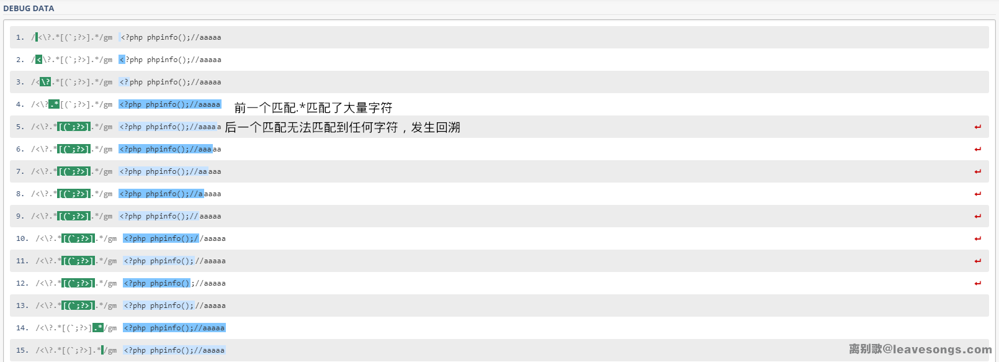

tags:: Regex, PCRE

- [参考](https://www.leavesongs.com/PENETRATION/use-pcre-backtrack-limit-to-bypass-restrict.html)
- # 原理
	- 某些正则表达式包含一个贪婪的任意字符匹配后加一个非贪婪的特定字符匹配
	- 此时我们可以通过传递大量“可以匹配前一部分，但是无法匹配后一个部分”的字符，产生大量回溯
	- 
	- 所以我们只需要提供大量前一部分可以匹配，但是后一部分不能匹配的字符即可产生大量回溯
- # 例题
	- [[CTF/WP/NISACTF 2022 middlerce]]