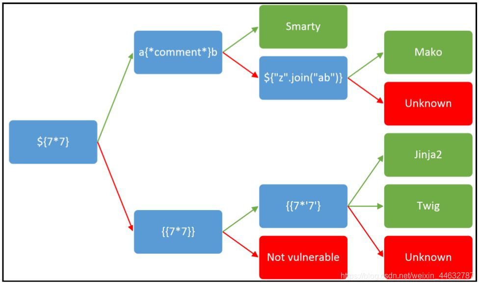

# Python
	- [[CTF/SSTI/Jinja]]
	- [[CTF/SSTI/Tornado]]
	- [[CTF/SSTI/Django]]
	- [[CTF/SSTI/web.py]]
- # PHP
	- [[CTF/SSTI/Smarty]]
	- [[CTF/SSTI/Twig]]
- # JS
	- [[CTF/SSTI/EJS]]
	- [[CTF/Pug]]
- # 其他
	- [[CTF/SSTI/ERB]]
	- [[CTF/SSTI/Golang_text_template]]
- # 判断
- 
	- 输入{{7*'7'}}，返回 49 表示是 Twig 模块
	- 输入{{7*'7'}}，返回 7777777 表示是 Jinja2 模块
	-