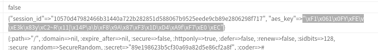

- # 观察
	- 题目提供了一个提交firstname和lastname的接口，提交后题目回显提交的值，并提示此时的`is_admin`值为1
	- 题目貌似将session的值签名保存在了cookie中，且其中包含AES Key。
	- 题目提示cookie中的rack.session字段和解题无关，此提示是假提示。AES Key正保存在rack.session中
- # 思路
	- 破解AES-ECB，伪造cookie从而获得admin身份
- # 破解AES-ECB
	- 会将每16Bytes的数据加密成32位的hex
		- [[draws/2023-03-01-18-59-18.excalidraw]]
	- 题目会将提交的firstname和lastname序列化成JSON，然后经过AES-ECB加密后放入cookie中，如果lastname足够长，其就能占据某个16Bytes的块，从而完全控制这个块的加密结果。
		- [[draws/2023-03-01-19-02-54.excalidraw]]
- # 伪造cookie
	- 伪造Cookie的脚本如下，payload长度必须为16的倍数
		- ```python
		  payload = "a" * 16
		  print(len(payload))
		  r = session.get(url, params = {
		      "action": "login",
		      "first_name": "",
		      "last_name": "a" * 2 + payload + "a" * 16
		  })
		  print(session.cookies["user"][64:-64])
		  print(session.cookies["rack.session"])
		  ```
	- 使用伪造AES-ECB的技巧伪造Cookie中的user，让其的值为`aaaaaaaaaaaaaaaa`，环境出错，显示json解析错误，无法识别token `aaaaaaaaaaaaaaaa`
	  id:: 63ff3186-232c-4edf-92c8-eede575cbbd6
	- 伪造Cookie为`[1,1,4,5,1,4,1111111111111111111111111]`，题目环境报错，爆出AES Key
		- 
	- 使用其中的aes_key即可伪造任意cookie，将Cookie伪造为`{"is_admin":1,"first_name":"","last_name":"aa"}`即可得到flag
		- {:height 296, :width 502}
	-