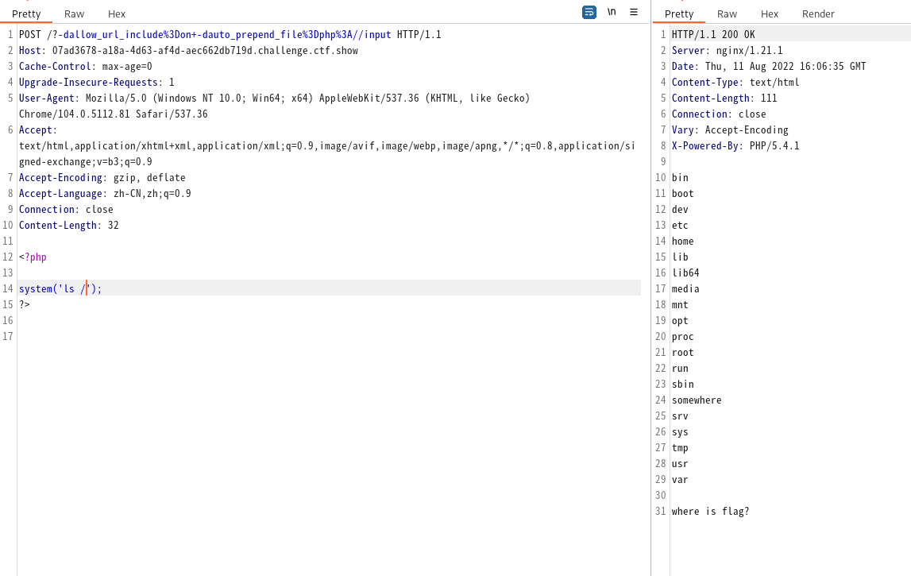

tags:: CTFWEB/PHP/CGI

- # 路线
- php-cgi会将路径中的参数解析成它的启动参数
	- [[CVE-2012-1823]]
- 所以我们可以通过它改动`php.ini`的配置，通过`auto_prepend_file`执行任意PHP代码
- # 使用参数添加配置
- 直接在路径后加上参数即可
	- 比如：`http://a2f4dd46-cb5b-416b-ab58-30a6cdcbf24f.challenge.ctf.show/?-d%20auto_prepend_file%3D/etc/passwd`
- # 利用`auto_prepend_file`执行代码
- 本题的环境是`PHP/5.4.1`和`nginx/1.21.1`
- 通过观察发现部分字符会被转引号转义，包括
	- `<`
	- `;`
	- 等等
- 也就是说我们无法使用`data://text/plain,<?php...`和`data://text/plain;base64,PD...`
- 但是我们可以使用`php://input`和`http://`
- 而且本体在将括号转义为`%20`时会发生解析错误，需要转义为`+`
- 
-