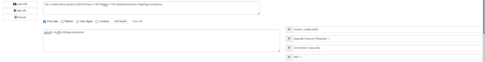

# hate eat snake
	- js源码分析
	- 只要修改分数判断函数即可修改分数，拿到flag
- # 受不了一点
	- php经典弱类型
	- payload
		- 
- # EZ WEB
	- 查看主页源码，看见`/src`
	- 查看`/src`，拿到app.py
	- 查看app.py，看到flag的隐藏URI
	- 使用`PUT`访问URI, 得到flag
- # <ez ze>
	- `pip install fenjing`
	- `python -m fenjing scan --url http://node6.anna.nssctf.cn:28437`
	- 然后执行`cat /flag`即可