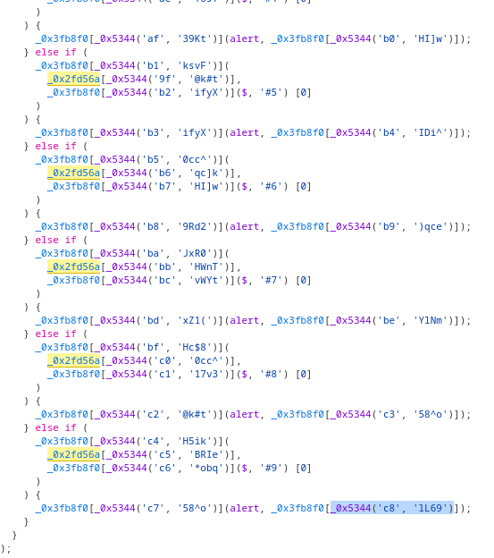

- > 只记录非常规题目
- # 上传
	- ((6569d71e-4867-42a5-8342-267690955af1))
- # 蜜雪冰城吉警店
	- 不熟JS反混淆，仔细看了下
	- 题目有8个点单按钮，提示点击第9个隐藏单子可以拿flag
	- 按钮有一个event listener，切换到source并用左下角的pretty print格式化代码，全局搜变量名找到对应函数
	- 其中用了经典的JS混淆套路：用一个函数计算对应字符串并返回
		- 混淆后代码逻辑大致不变，只不过是用映射表和函数替换了原有的字符串而已
		- 查对应函数对应的字符串，可以使用右边查看表达式
		- 
- # 其他大佬的笔记
	- https://blog.csdn.net/weixin_43296565/article/details/131066567
	-